# Complete UML Architecture - Pong Game Project

## Full System Architecture Diagram

This is a comprehensive UML class diagram showing all design patterns and their relationships in one unified view.

```mermaid
classDiagram
    %% ========================================
    %% SINGLETON PATTERN - Game Manager
    %% ========================================
    class GameManager {
        <<singleton>>
        -GameManager _instance$
        -object _lock$
        +GameManager Instance$
        -GameContext Context
        -StateMachine StateMachine
        -MenuState MenuState
        -PlayState PlayState
        -GameOverState GameOverState
        -GameUI _gameUI
        -IGameEntityFactory _factory
        -GameManager()
        +InitializeGame()
        +Run()
        +Update(deltaTime)
        +HandleInput()
    }

    %% ========================================
    %% STATE PATTERN
    %% ========================================
    class IGameState {
        <<interface>>
        +Enter()
        +Update(deltaTime)
        +Exit()
    }
    
    class StateMachine {
        -IGameState _currentState
        -Dictionary~string,IGameState~ _states
        +AddState(name, state)
        +ChangeState(stateName)
        +Update(deltaTime)
        +GetCurrentState() IGameState
    }
    
    class MenuState {
        -GameContext _context
        +Enter()
        +Update(deltaTime)
        +Exit()
    }
    
    class PlayState {
        -GameContext _context
        -InputHandler _inputHandler
        -CollisionHandler _collisionHandler
        +Enter()
        +Update(deltaTime)
        +Exit()
    }
    
    class GameOverState {
        -GameContext _context
        +Enter()
        +Update(deltaTime)
        +Exit()
    }

    %% ========================================
    %% GAME CONTEXT - IMPROVED STRUCTURE
    %% ========================================
    class GameContext {
        +GameEntities Entities
        +GameServices Services
        +ScoreSubject ScoreSubject
        +int WindowWidth
        +int WindowHeight
        +Ball Ball
        +Paddle LeftPaddle
        +Paddle RightPaddle
        +List~Wall~ Walls
        +Scoreboard Scoreboard
        +SoundManager SoundManager
        +PowerUpManager PowerUpManager
        +ActiveEffectManager ActiveEffectManager
        +InitializeScoreSubject()
    }

    class GameEntities {
        +Ball Ball
        +Paddle LeftPaddle
        +Paddle RightPaddle
        +List~Wall~ Walls
        +ResetPositions()
    }

    class GameServices {
        +SoundManager SoundManager
        +PowerUpManager PowerUpManager
        +ActiveEffectManager ActiveEffectManager
        +ClearAll()
    }

    %% ========================================
    %% COMPONENT PATTERN
    %% ========================================
    class IComponent {
        <<interface>>
        +Update(deltaTime)
    }
    
    class GameObject {
        <<abstract>>
        #List~IComponent~ _components
        +AddComponent(component)
        +RemoveComponent(component)
        +GetComponent~T~() T
        +Update(deltaTime)
        +Draw()*
    }
    
    class TransformComponent {
        +float X
        +float Y
        +float Width
        +float Height
        +GetBounds() Rectangle
        +Update(deltaTime)
    }
    
    class MovementComponent {
        -TransformComponent _transform
        +Vector2D Velocity
        +float Speed
        +Update(deltaTime)
        +SetVelocity(x, y)
    }
    
    class RenderComponent {
        -TransformComponent _transform
        +Color Color
        +bool IsCircle
        +Update(deltaTime)
        +Draw()
    }
    
    class CollisionComponent {
        -TransformComponent _transform
        +CheckCollision(other) bool
        +Update(deltaTime)
    }

    %% ========================================
    %% GAME ENTITIES
    %% ========================================
    class Ball {
        -TransformComponent _transform
        -MovementComponent _movement
        -RenderComponent _render
        +float X
        +float Y
        +int Size
        +Vector2D Velocity
        +float Speed
        +Color Color
        +Move()
        +Bounce(surfaceNormal)
        +ResetPosition()
        +Update(deltaTime)
        +Draw()
        +GetSpeed() float
        +GetSize() float
    }
    
    class Paddle {
        -TransformComponent _transform
        -RenderComponent _render
        +float X
        +float Y
        +int Width
        +int Height
        +float Speed
        +Color Color
        +MoveUp()
        +MoveDown()
        +ResetSpeed()
        +ResetPosition()
        +Update(deltaTime)
        +Draw()
        +GetSpeed() float
        +GetSize() float
    }
    
    class Wall {
        -TransformComponent _transform
        -RenderComponent _render
        +float X
        +float Y
        +int Width
        +int Height
        +float Speed
        +Color Color
        +Move()
        +Update(deltaTime)
        +Draw()
    }

    class Scoreboard {
        +int LeftScore
        +int RightScore
        +IncrementLeft()
        +IncrementRight()
        +GetTotalScore() int
        +Reset()
    }

    class Vector2D {
        +float X
        +float Y
        +float Magnitude
        +Normalize() Vector2D
        +DotProduct(other) float
        +Copy() Vector2D
        +Multiply(scalar) Vector2D
        +Subtract(other) Vector2D
    }

    %% ========================================
    %% DECORATOR PATTERN
    %% ========================================
    class IGameEntity {
        <<interface>>
        +GetSpeed() float
        +GetSize() float
        +Update(deltaTime)
    }
    
    class EntityDecorator {
        <<abstract>>
        #IGameEntity _wrappedEntity
        +GetSpeed() float
        +GetSize() float
        +Update(deltaTime)
    }
    
    class SpeedBoostDecorator {
        -float _speedMultiplier
        -DateTime _startTime
        -double _duration
        +GetSpeed() float
        +IsActive() bool
    }
    
    class SpeedReductionDecorator {
        -float _speedMultiplier
        -DateTime _startTime
        -double _duration
        +GetSpeed() float
        +IsActive() bool
    }
    
    class SizeBoostDecorator {
        -float _sizeMultiplier
        -DateTime _startTime
        -double _duration
        +GetSize() float
        +IsActive() bool
    }

    %% ========================================
    %% FACTORY PATTERN
    %% ========================================
    class IGameEntityFactory {
        <<interface>>
        +CreateBall(width, height) Ball
        +CreatePaddle(x, y, height) Paddle
        +CreateWall(x, y, height, speed) Wall
        +CreateScoreboard() Scoreboard
        +CreateWalls(num, minDist, height) List~Wall~
        +CalculateWallCount(score, base) int
    }
    
    class GameEntityFactory {
        +CreateBall(width, height) Ball
        +CreatePaddle(x, y, height) Paddle
        +CreateWall(x, y, height, speed) Wall
        +CreateScoreboard() Scoreboard
        +CreateWalls(num, minDist, height) List~Wall~
        +CalculateWallCount(score, base) int
    }

    %% ========================================
    %% OBSERVER PATTERN
    %% ========================================
    class ISubject {
        <<interface>>
        +Attach(observer)
        +Detach(observer)
        +Notify()
    }
    
    class IObserver {
        <<interface>>
        +Update(subject)
    }
    
    class ScoreSubject {
        -List~IObserver~ _observers
        -Scoreboard _scoreboard
        -Ball _ball
        -SoundManager _soundManager
        -ActiveEffectManager _effectManager
        +Attach(observer)
        +Detach(observer)
        +Notify()
        +IncrementLeftScore()
        +IncrementRightScore()
        +GetScoreboard() Scoreboard
        +InjectDependencies(ball, sound, effect)
    }
    
    class SoundScoreObserver {
        -SoundManager _soundManager
        +Update(subject)
    }
    
    class WallScoreObserver {
        -GameContext _context
        -IGameEntityFactory _factory
        +Update(subject)
    }
    
    class EffectScoreObserver {
        -ActiveEffectManager _effectManager
        +Update(subject)
    }

    %% ========================================
    %% SIMPLIFIED INPUT HANDLING (Command Pattern Removed)
    %% ========================================
    class InputHandler {
        +HandleKeyInput(leftPaddle, rightPaddle)
        +UpdatePaddleMovement(leftPaddle, rightPaddle)
    }

    %% ========================================
    %% SERVICES & MANAGERS
    %% ========================================
    class SoundManager {
        +PlayBounce()
        +PlayScore()
        +PlayPowerUp()
        +PlayGameOver()
    }
    
    class PowerUpManager {
        -List~PowerUp~ _activePowerUps
        -int _windowWidth
        -int _windowHeight
        +Update(deltaTime)
        +Draw()
        +SpawnPowerUp()
        +CheckCollision(ball) PowerUp
    }
    
    class ActiveEffectManager {
        -Ball _ball
        -Paddle _leftPaddle
        -Paddle _rightPaddle
        +ApplyEffect(type, target)
        +Update(deltaTime)
        +HasActiveEffect() bool
        +ClearAllEffects()
    }
    
    class InputHandler {
        -Dictionary~KeyCode,ICommand~ _commands
        +HandleInput(context)
        +ProcessCommands()
    }
    
    class CollisionHandler {
        +CheckBallPaddleCollision(ball, paddle) bool
        +CheckBallWallCollision(ball, wall) bool
        +HandleCollision(ball, surface)
        +HandlePowerUpCollision(ball, powerUp)
    }
    
    class UIRenderer {
        +RenderScore(scoreboard)
        +RenderMenu()
        +RenderGameOver(scoreboard)
        +RenderPowerUps()
    }

    class GameUI {
        -int _windowWidth
        -int _windowHeight
        +DrawMenu()
        +DrawGameOver(scoreboard)
        +DrawPauseMenu()
    }

    %% ========================================
    %% RELATIONSHIPS - Singleton Pattern
    %% ========================================
    GameManager --> GameContext : contains
    GameManager --> StateMachine : manages
    GameManager --> IGameEntityFactory : uses
    GameManager --> GameUI : uses

    %% ========================================
    %% RELATIONSHIPS - State Pattern
    %% ========================================
    StateMachine o-- IGameState : manages
    IGameState <|.. MenuState : implements
    IGameState <|.. PlayState : implements
    IGameState <|.. GameOverState : implements
    MenuState --> GameContext : uses
    PlayState --> GameContext : uses
    PlayState --> InputHandler : uses
    PlayState --> CollisionHandler : uses
    GameOverState --> GameContext : uses

    %% ========================================
    %% RELATIONSHIPS - Component Pattern
    %% ========================================
    GameObject *-- IComponent : contains
    IComponent <|.. TransformComponent : implements
    IComponent <|.. MovementComponent : implements
    IComponent <|.. RenderComponent : implements
    IComponent <|.. CollisionComponent : implements
    GameObject <|-- Ball : inherits
    GameObject <|-- Paddle : inherits
    GameObject <|-- Wall : inherits
    
    Ball --> TransformComponent : has
    Ball --> MovementComponent : has
    Ball --> RenderComponent : has
    Paddle --> TransformComponent : has
    Paddle --> RenderComponent : has
    Wall --> TransformComponent : has
    Wall --> RenderComponent : has

    %% ========================================
    %% RELATIONSHIPS - Game Context (Improved Structure)
    %% ========================================
    GameContext --> GameEntities : contains
    GameContext --> GameServices : contains
    GameContext --> ScoreSubject : manages
    
    GameEntities --> Ball : contains
    GameEntities --> Paddle : contains left/right
    GameEntities --> Wall : contains list
    
    GameServices --> SoundManager : contains
    GameServices --> PowerUpManager : contains
    GameServices --> ActiveEffectManager : contains

    %% ========================================
    %% RELATIONSHIPS - Decorator Pattern
    %% ========================================
    IGameEntity <|.. Ball : implements
    IGameEntity <|.. Paddle : implements
    IGameEntity <|.. EntityDecorator : implements
    EntityDecorator <|-- SpeedBoostDecorator : extends
    EntityDecorator <|-- SpeedReductionDecorator : extends
    EntityDecorator <|-- SizeBoostDecorator : extends
    EntityDecorator o-- IGameEntity : wraps

    %% ========================================
    %% RELATIONSHIPS - Factory Pattern
    %% ========================================
    IGameEntityFactory <|.. GameEntityFactory : implements
    GameEntityFactory ..> Ball : creates
    GameEntityFactory ..> Paddle : creates
    GameEntityFactory ..> Wall : creates
    GameEntityFactory ..> Scoreboard : creates

    %% ========================================
    %% RELATIONSHIPS - Observer Pattern
    %% ========================================
    ISubject <|.. ScoreSubject : implements
    IObserver <|.. SoundScoreObserver : implements
    IObserver <|.. WallScoreObserver : implements
    IObserver <|.. EffectScoreObserver : implements
    ScoreSubject o-- IObserver : notifies
    ScoreSubject --> Scoreboard : manages
    ScoreSubject --> Ball : uses
    ScoreSubject --> SoundManager : uses
    ScoreSubject --> ActiveEffectManager : uses
    SoundScoreObserver --> SoundManager : uses
    WallScoreObserver --> GameContext : uses
    WallScoreObserver --> IGameEntityFactory : uses
    EffectScoreObserver --> ActiveEffectManager : uses

    %% ========================================
    %% RELATIONSHIPS - Simplified Input Handling
    %% ========================================
    InputHandler --> Paddle : calls directly (MoveUp/MoveDown/ResetSpeed)

    %% ========================================
    %% RELATIONSHIPS - Services
    %% ========================================
    ActiveEffectManager --> Ball : applies effects
    ActiveEffectManager --> Paddle : applies effects
    ActiveEffectManager --> EntityDecorator : creates
    CollisionHandler --> Ball : checks
    CollisionHandler --> Paddle : checks
    CollisionHandler --> Wall : checks
    PlayState --> UIRenderer : uses
    GameUI --> Scoreboard : displays

    %% ========================================
    %% RELATIONSHIPS - Utilities
    %% ========================================
    Ball ..> Vector2D : uses
    MovementComponent ..> Vector2D : uses

    %% ========================================
    %% STYLING
    %% ========================================
    class GameManager:::singleton
    class IGameState:::interface
    class IComponent:::interface
    class IGameEntity:::interface
    class ISubject:::interface
    class IObserver:::interface
    class IGameEntityFactory:::interface
    class GameObject:::abstract
    class EntityDecorator:::abstract
    class GameEntities:::container
    class GameServices:::container
    
    classDef singleton fill:#f9d71c,stroke:#333,stroke-width:3px
    classDef interface fill:#e1f5ff,stroke:#333,stroke-width:2px
    classDef abstract fill:#fff4e6,stroke:#333,stroke-width:2px
    classDef container fill:#d4edda,stroke:#333,stroke-width:2px
```

