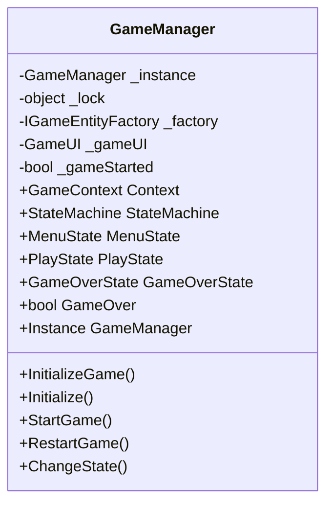

# Singleton Pattern - Game Manager

## Mô tả
Singleton Pattern đảm bảo chỉ có một instance duy nhất của GameManager trong suốt vòng đời ứng dụng, quản lý trạng thái game toàn cục.

## UML Diagram



## Implementation Details

### Singleton Features:
- **Private Constructor**: Ngăn việc tạo instance từ bên ngoài
- **Static Instance**: Biến static `_instance` giữ instance duy nhất
- **Thread-Safe**: Sử dụng `lock` để đảm bảo thread safety
- **Lazy Initialization**: Instance được tạo khi lần đầu truy cập

### Code Structure:
```csharp
public class GameManager
{
    private static GameManager _instance;
    private static object _lock = new object();
    
    public static GameManager Instance
    {
        get
        {
            lock (_lock)
            {
                if (_instance == null)
                {
                    _instance = new GameManager();
                }
                return _instance;
            }
        }
    }
    
    private GameManager() { }
}
```

### Responsibilities:
1. Quản lý game context
2. Khởi tạo state machine
3. Điều phối các trạng thái game
4. Quản lý UI và factory
