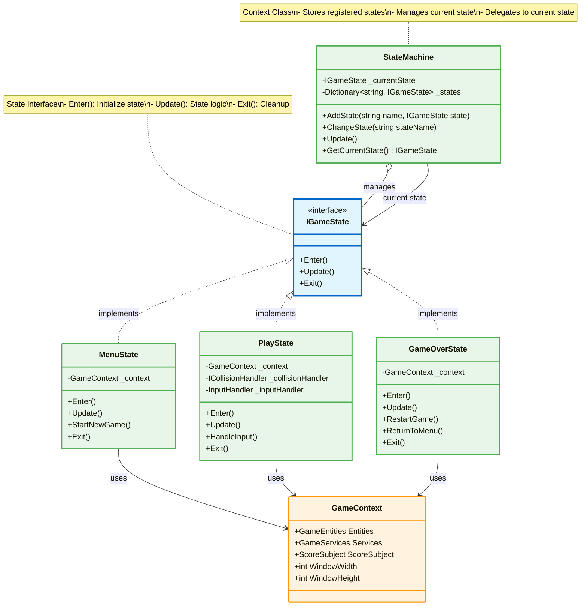
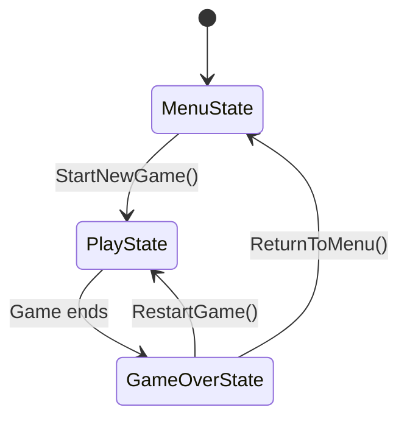

# State Pattern - Game States

## Mô tả
State Pattern cho phép object thay đổi hành vi khi internal state thay đổi. Game có 3 trạng thái chính: Menu, Play, và GameOver.

## UML Diagram



## State Transitions



## Implementation Details

### State Interface (IGameState):
```csharp
public interface IGameState
{
    void Enter();    // Called when entering this state
    void Update();   // Called every frame
    void Exit();     // Called when leaving this state
}
```

### State Machine:
```csharp
public class StateMachine
{
    private IGameState _currentState;
    private Dictionary<string, IGameState> _states;
    
    public void ChangeState(string stateName)
    {
        _currentState?.Exit();
        _currentState = _states[stateName];
        _currentState?.Enter();
    }
}
```

### Concrete States:

#### MenuState:
- Enter: Hiển thị menu, phát nhạc nền
- Update: Xử lý input menu
- Exit: Dừng nhạc menu

#### PlayState:
- Enter: Khởi tạo game entities, spawn power-ups
- Update: Game loop chính (input, physics, collision)
- Exit: Dừng game, cleanup

#### GameOverState:
- Enter: Hiển thị kết quả, phát nhạc game over
- Update: Xử lý input restart/menu
- Exit: Cleanup UI

## Benefits:
1. ✅ Tách biệt logic của từng state
2. ✅ Dễ dàng thêm states mới
3. ✅ Avoid massive if/switch statements
4. ✅ State transitions rõ ràng
