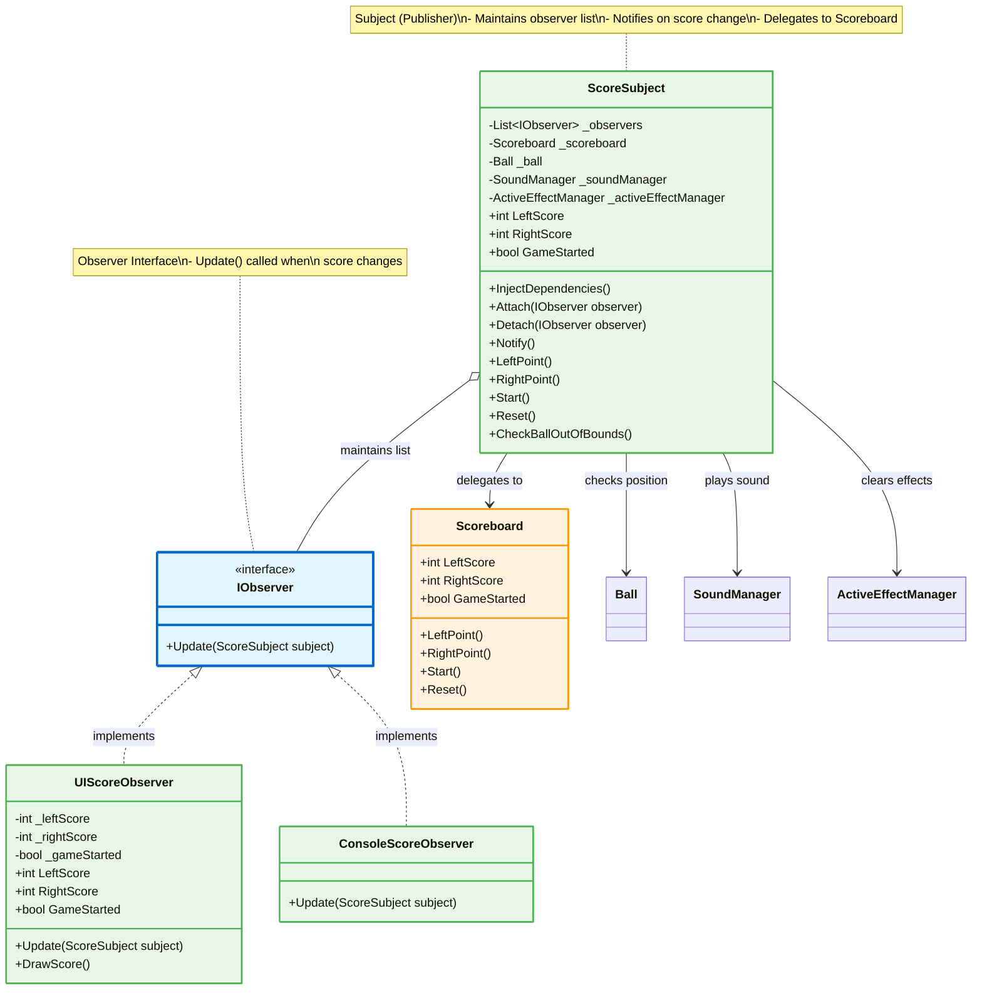
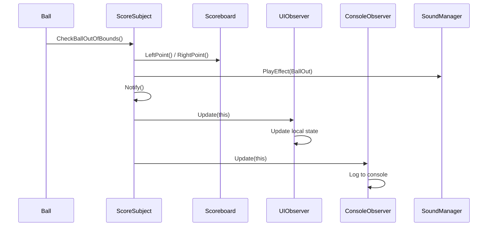

# Observer Pattern - Score System

## Mô tả
Observer Pattern cho phép objects subscribe và nhận thông báo khi có thay đổi về điểm số. Tách biệt logic scoring khỏi UI rendering.

## UML Diagram



## Observer Pattern Flow



## Implementation Details

### Observer Interface:
```csharp
public interface IObserver
{
    void Update(ScoreSubject subject);
}
```

### Subject (ScoreSubject):
```csharp
public class ScoreSubject
{
    private List<IObserver> _observers = new List<IObserver>();
    private Scoreboard _scoreboard;
    
    public void Attach(IObserver observer)
    {
        _observers.Add(observer);
    }
    
    public void Detach(IObserver observer)
    {
        _observers.Remove(observer);
    }
    
    public void Notify()
    {
        foreach (var observer in _observers)
        {
            observer.Update(this);
        }
    }
    
    public void LeftPoint()
    {
        _scoreboard.LeftPoint();
        _soundManager.PlayEffect(SoundType.BallOut);
        Notify(); // Notify all observers
    }
}
```

### Concrete Observers:

#### UIScoreObserver:
- Cập nhật UI score display
- Render điểm số lên màn hình
- Pull data từ ScoreSubject

#### ConsoleScoreObserver:
- Log điểm số ra console
- Debug và monitoring

## Key Features:

### Subject Responsibilities:
1. ✅ Maintain observer list (Attach/Detach)
2. ✅ Notify observers on state change
3. ✅ Delegate scoring logic to Scoreboard
4. ✅ Coordinate với SoundManager, EffectManager

### Observer Responsibilities:
1. ✅ Register với Subject
2. ✅ Update local state khi notified
3. ✅ Pull data từ Subject (không push)

## Benefits:
1. ✅ Loose coupling: Subject không biết concrete observers
2. ✅ Dễ thêm observers mới (Open/Closed Principle)
3. ✅ Tách biệt business logic khỏi presentation
4. ✅ Multiple views của cùng data
