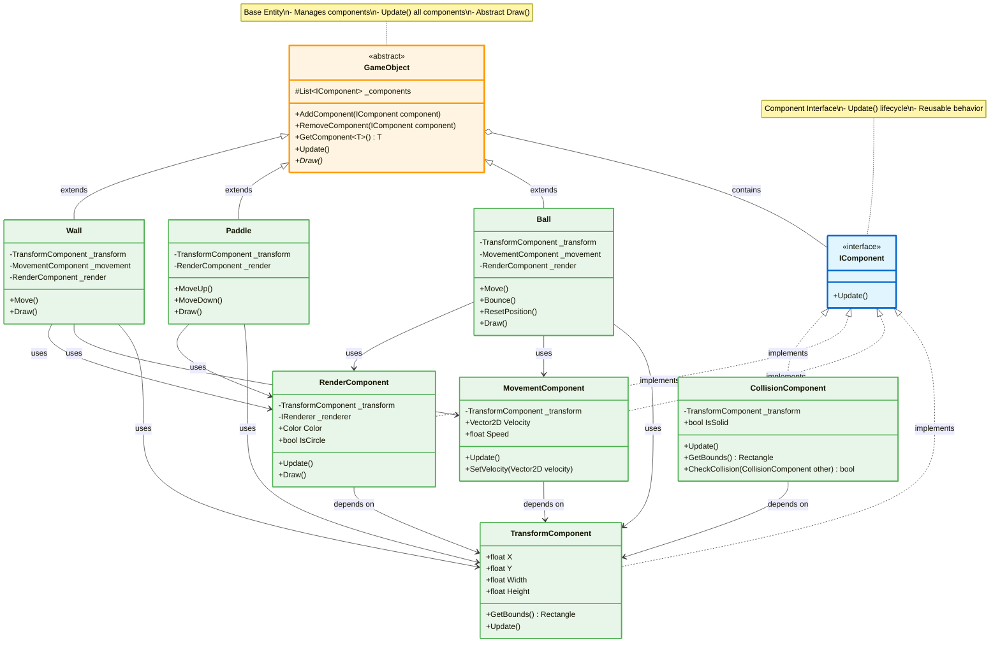
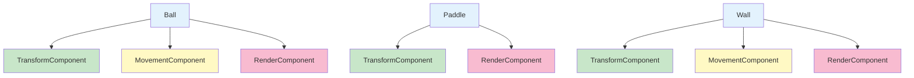

# Component Pattern - Game Entities

## Mô tả
Component Pattern cho phép entities được compose từ các components độc lập, tái sử dụng được. Thay vì inheritance hierarchy, sử dụng composition.

## UML Diagram



## Component Types

### Core Components:

#### 1. **TransformComponent**
- **Purpose**: Position, size, bounds
- **Data**: X, Y, Width, Height
- **Methods**: GetBounds()

#### 2. **MovementComponent**
- **Purpose**: Velocity, speed logic
- **Dependencies**: TransformComponent
- **Methods**: SetVelocity(), Update() position

#### 3. **RenderComponent**
- **Purpose**: Visual representation
- **Dependencies**: TransformComponent, IRenderer
- **Methods**: Draw()

#### 4. **CollisionComponent**
- **Purpose**: Collision detection
- **Dependencies**: TransformComponent
- **Methods**: CheckCollision(), GetBounds()

## Entity Composition



## Implementation Details

### GameObject Base Class:
```csharp
public abstract class GameObject
{
    protected List<IComponent> _components = new List<IComponent>();
    
    public void AddComponent(IComponent component)
    {
        _components.Add(component);
    }
    
    public T GetComponent<T>() where T : IComponent
    {
        return _components.OfType<T>().FirstOrDefault();
    }
    
    public void Update()
    {
        foreach (var component in _components)
        {
            component.Update();
        }
    }
    
    public abstract void Draw();
}
```

### Component Implementation:
```csharp
public class TransformComponent : IComponent
{
    public float X { get; set; }
    public float Y { get; set; }
    public float Width { get; set; }
    public float Height { get; set; }
    
    public Rectangle GetBounds()
    {
        return new Rectangle(X, Y, Width, Height);
    }
    
    public void Update() { }
}

public class MovementComponent : IComponent
{
    private TransformComponent _transform;
    public Vector2D Velocity { get; set; }
    public float Speed { get; set; }
    
    public void Update()
    {
        _transform.X += Velocity.X * Speed;
        _transform.Y += Velocity.Y * Speed;
    }
}
```

### Entity Usage:
```csharp
public class Ball : GameObject
{
    private TransformComponent _transform;
    private MovementComponent _movement;
    
    public Ball()
    {
        _transform = new TransformComponent();
        _movement = new MovementComponent { _transform };
        
        AddComponent(_transform);
        AddComponent(_movement);
    }
    
    public void Move()
    {
        Update(); // Updates all components
    }
}
```

## Benefits:
1. ✅ **Composition over Inheritance**: Linh hoạt hơn inheritance
2. ✅ **Reusability**: Components tái sử dụng cho nhiều entities
3. ✅ **Separation of Concerns**: Mỗi component có 1 responsibility
4. ✅ **Easy Extension**: Thêm components mới không ảnh hưởng code cũ
5. ✅ **Flexibility**: Entities có thể add/remove components runtime
