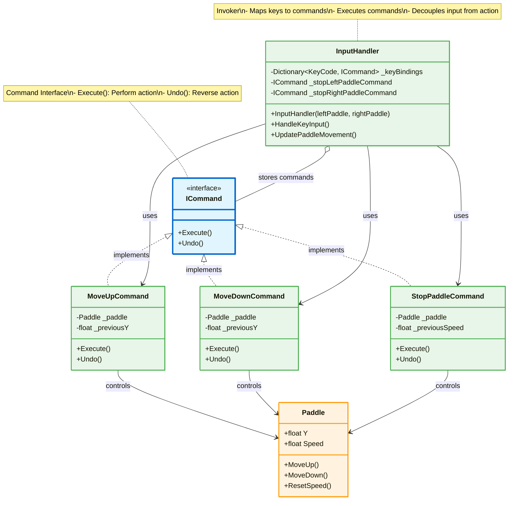
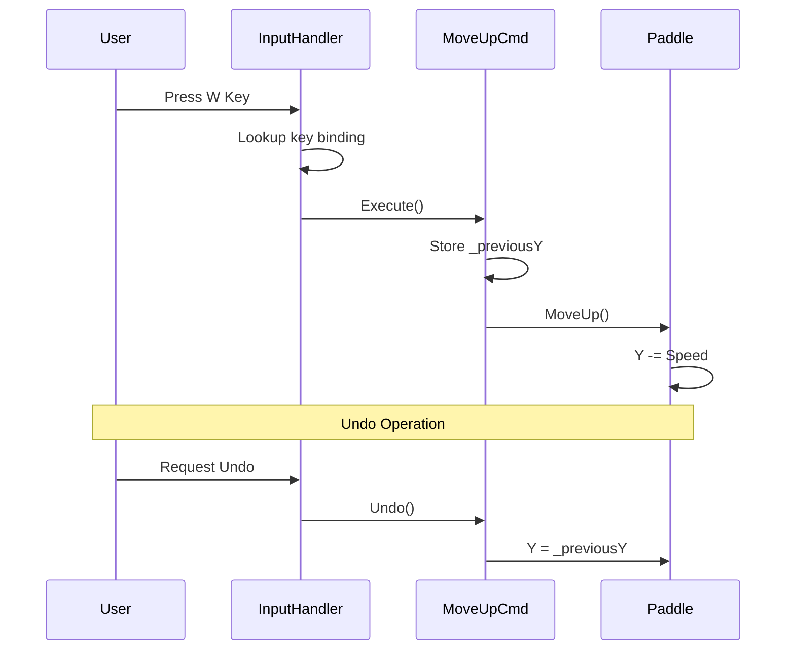
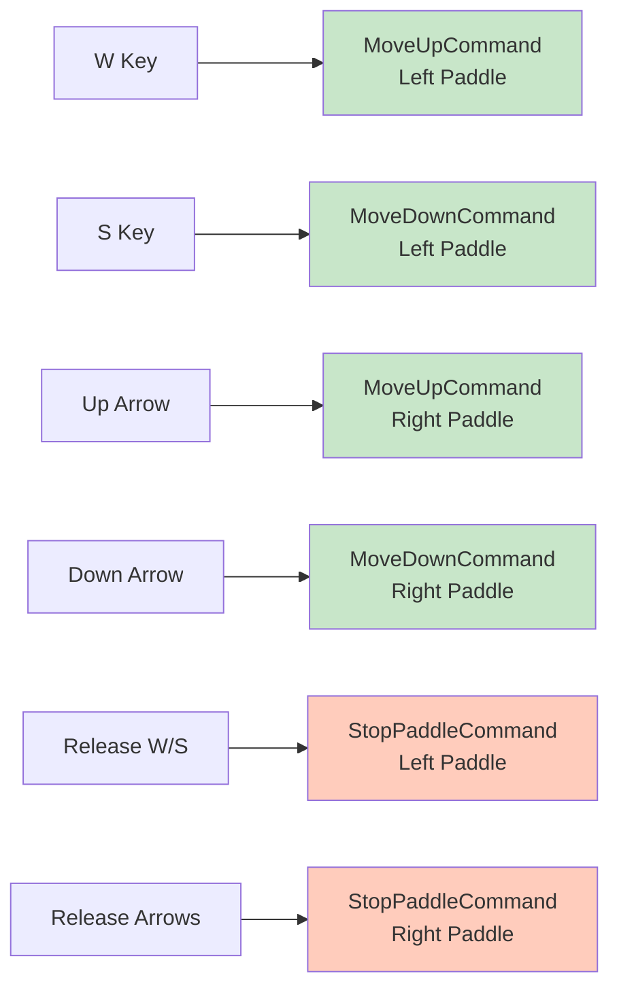

# Command Pattern - Input Handling

## Mô tả
Command Pattern đóng gói requests thành objects, cho phép parameterize clients với queues, requests, và hỗ trợ undo operations.

## UML Diagram



## Command Pattern Flow



## Key Bindings



## Implementation Details

### Command Interface:
```csharp
public interface ICommand
{
    void Execute();
    void Undo();
}
```

### Concrete Commands:

#### MoveUpCommand:
```csharp
public class MoveUpCommand : ICommand
{
    private Paddle _paddle;
    private float _previousY;
    
    public MoveUpCommand(Paddle paddle)
    {
        _paddle = paddle;
    }
    
    public void Execute()
    {
        _previousY = _paddle.Y;
        _paddle.MoveUp();
    }
    
    public void Undo()
    {
        _paddle.Y = _previousY;
    }
}
```

#### MoveDownCommand:
```csharp
public class MoveDownCommand : ICommand
{
    private Paddle _paddle;
    private float _previousY;
    
    public MoveDownCommand(Paddle paddle)
    {
        _paddle = paddle;
    }
    
    public void Execute()
    {
        _previousY = _paddle.Y;
        _paddle.MoveDown();
    }
    
    public void Undo()
    {
        _paddle.Y = _previousY;
    }
}
```

#### StopPaddleCommand:
```csharp
public class StopPaddleCommand : ICommand
{
    private Paddle _paddle;
    private float _previousSpeed;
    
    public StopPaddleCommand(Paddle paddle)
    {
        _paddle = paddle;
    }
    
    public void Execute()
    {
        _previousSpeed = _paddle.Speed;
        _paddle.ResetSpeed();
    }
    
    public void Undo()
    {
        _paddle.Speed = _previousSpeed;
    }
}
```

### InputHandler (Invoker):
```csharp
public class InputHandler
{
    private Dictionary<KeyCode, ICommand> _keyBindings;
    private ICommand _stopLeftPaddleCommand;
    private ICommand _stopRightPaddleCommand;
    
    public InputHandler(Paddle leftPaddle, Paddle rightPaddle)
    {
        _keyBindings = new Dictionary<KeyCode, ICommand>
        {
            { KeyCode.W, new MoveUpCommand(leftPaddle) },
            { KeyCode.S, new MoveDownCommand(leftPaddle) },
            { KeyCode.UpKey, new MoveUpCommand(rightPaddle) },
            { KeyCode.DownKey, new MoveDownCommand(rightPaddle) }
        };
        
        _stopLeftPaddleCommand = new StopPaddleCommand(leftPaddle);
        _stopRightPaddleCommand = new StopPaddleCommand(rightPaddle);
    }
    
    public void HandleKeyInput()
    {
        foreach (var binding in _keyBindings)
        {
            if (SplashKit.KeyDown(binding.Key))
            {
                binding.Value.Execute();
            }
        }
    }
    
    public void UpdatePaddleMovement()
    {
        if (!SplashKit.KeyDown(KeyCode.W) && !SplashKit.KeyDown(KeyCode.S))
            _stopLeftPaddleCommand.Execute();
            
        if (!SplashKit.KeyDown(KeyCode.UpKey) && !SplashKit.KeyDown(KeyCode.DownKey))
            _stopRightPaddleCommand.Execute();
    }
}
```

## Benefits:
1. ✅ **Decoupling**: Tách input detection khỏi action execution
2. ✅ **Undo/Redo**: Dễ dàng implement undo functionality
3. ✅ **Command Queuing**: Có thể queue commands để execute sau
4. ✅ **Macro Commands**: Combine nhiều commands thành 1
5. ✅ **Configurable**: Dễ dàng thay đổi key bindings
6. ✅ **Testability**: Test commands độc lập với input system

## Use Cases:
- ⚙️ Input handling (keyboard, gamepad)
- 🔄 Undo/Redo systems
- 📝 Macro recording
- 🎮 AI scripting
- 📊 Transaction systems
