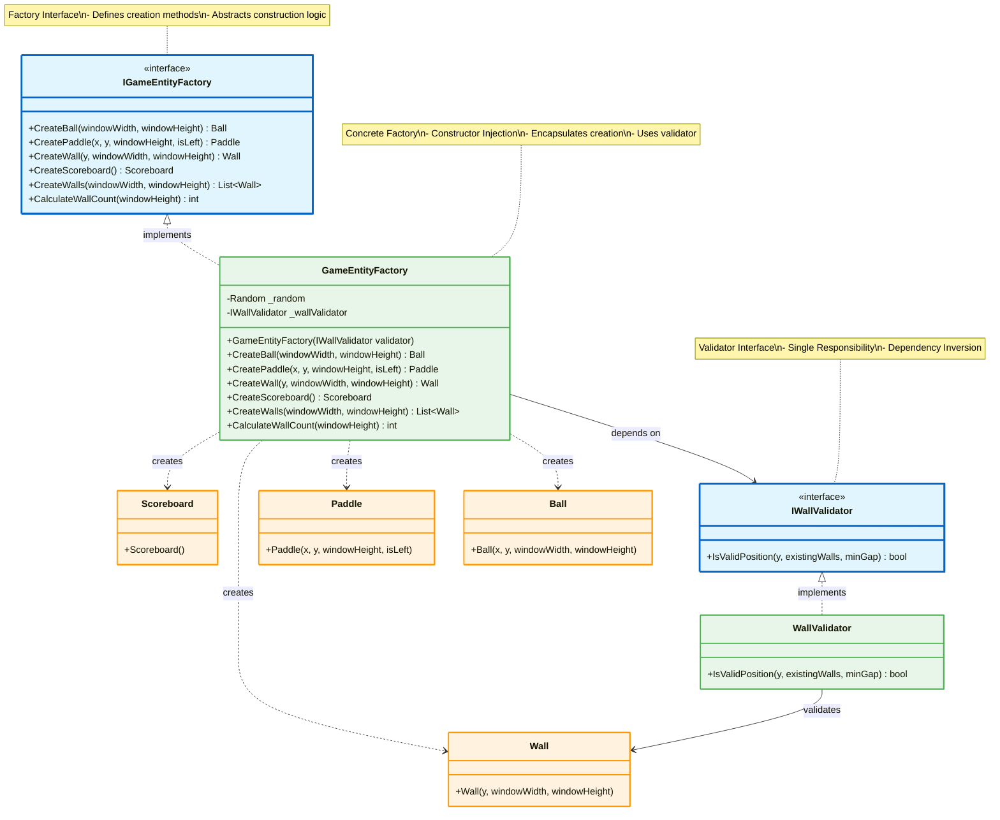
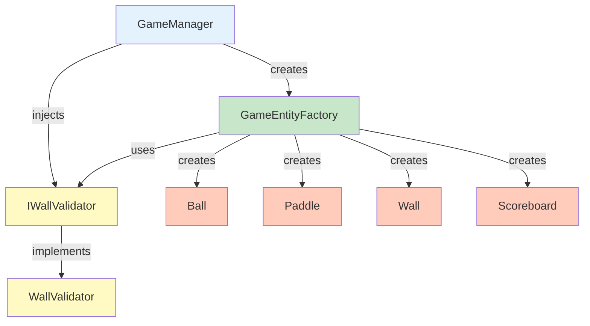

# Factory Pattern - Entity Creation

## Mô tả
Factory Pattern tập trung việc tạo objects vào một nơi, giảm coupling và tăng tính mở rộng. Sử dụng Dependency Injection để inject validators.

## UML Diagram



## Factory Pattern with DI



## Implementation Details

### Factory Interface:
```csharp
public interface IGameEntityFactory
{
    Ball CreateBall(int windowWidth, int windowHeight);
    Paddle CreatePaddle(float x, float y, int windowHeight, bool isLeft);
    Wall CreateWall(float y, int windowWidth, int windowHeight);
    Scoreboard CreateScoreboard();
    List<Wall> CreateWalls(int windowWidth, int windowHeight);
    int CalculateWallCount(int windowHeight);
}
```

### Concrete Factory:
```csharp
public class GameEntityFactory : IGameEntityFactory
{
    private readonly Random _random;
    private readonly IWallValidator _wallValidator;
    
    // Constructor Injection
    public GameEntityFactory(IWallValidator wallValidator)
    {
        _random = new Random();
        _wallValidator = wallValidator;
    }
    
    public Ball CreateBall(int windowWidth, int windowHeight)
    {
        float x = windowWidth / 2;
        float y = windowHeight / 2;
        return new Ball(x, y, windowWidth, windowHeight);
    }
    
    public Paddle CreatePaddle(float x, float y, int windowHeight, bool isLeft)
    {
        return new Paddle(x, y, windowHeight, isLeft);
    }
    
    public Wall CreateWall(float y, int windowWidth, int windowHeight)
    {
        return new Wall(y, windowWidth, windowHeight);
    }
    
    public Scoreboard CreateScoreboard()
    {
        return new Scoreboard();
    }
    
    public List<Wall> CreateWalls(int windowWidth, int windowHeight)
    {
        List<Wall> walls = new List<Wall>();
        int wallCount = CalculateWallCount(windowHeight);
        int minGap = 150;
        
        for (int i = 0; i < wallCount; i++)
        {
            int maxAttempts = 50;
            int attempts = 0;
            
            while (attempts < maxAttempts)
            {
                float y = _random.Next(50, windowHeight - 50);
                
                // Use injected validator
                if (_wallValidator.IsValidPosition(y, walls, minGap))
                {
                    walls.Add(CreateWall(y, windowWidth, windowHeight));
                    break;
                }
                
                attempts++;
            }
        }
        
        return walls;
    }
    
    public int CalculateWallCount(int windowHeight)
    {
        return windowHeight / 200;
    }
}
```

### Wall Validator (Dependency Inversion):
```csharp
public interface IWallValidator
{
    bool IsValidPosition(float y, List<Wall> existingWalls, int minGap);
}

public class WallValidator : IWallValidator
{
    public bool IsValidPosition(float y, List<Wall> existingWalls, int minGap)
    {
        foreach (var wall in existingWalls)
        {
            if (Math.Abs(wall.Y - y) < minGap)
            {
                return false;
            }
        }
        return true;
    }
}
```

### Factory Usage:
```csharp
// Setup Dependency Injection
IWallValidator validator = new WallValidator();
IGameEntityFactory factory = new GameEntityFactory(validator);

// Create entities
Ball ball = factory.CreateBall(800, 600);
Paddle leftPaddle = factory.CreatePaddle(50, 250, 600, true);
Paddle rightPaddle = factory.CreatePaddle(730, 250, 600, false);
List<Wall> walls = factory.CreateWalls(800, 600);
Scoreboard scoreboard = factory.CreateScoreboard();
```

## SOLID Principles Applied

### Single Responsibility:
- ✅ **GameEntityFactory**: Chỉ lo creation logic
- ✅ **WallValidator**: Chỉ lo validation logic
- ✅ Tách Wall validation khỏi Wall entity

### Open/Closed:
- ✅ Mở rộng bằng cách thêm factory methods mới
- ✅ Không cần sửa code khi thêm entity types

### Liskov Substitution:
- ✅ Có thể swap IGameEntityFactory implementations

### Interface Segregation:
- ✅ IWallValidator là focused interface
- ✅ Không force unused methods

### Dependency Inversion:
- ✅ Factory depends on IWallValidator abstraction
- ✅ High-level không depend vào low-level details

## Benefits:
1. ✅ **Centralized Creation**: Tất cả creation logic ở 1 nơi
2. ✅ **Reduced Coupling**: Clients không cần biết constructors
3. ✅ **Testability**: Dễ mock factory cho testing
4. ✅ **Consistency**: Đảm bảo entities được tạo đúng cách
5. ✅ **Dependency Injection**: Inject validators, renderers
6. ✅ **Single Responsibility**: Tách validation logic ra khỏi entities
