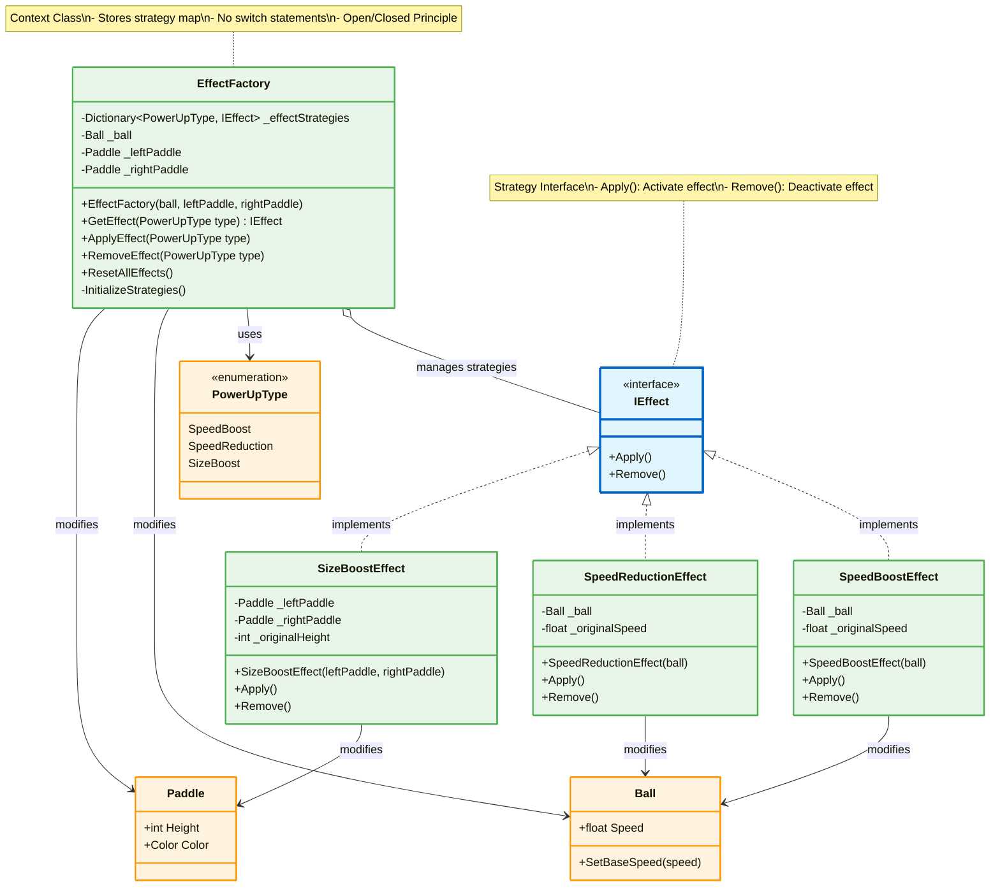
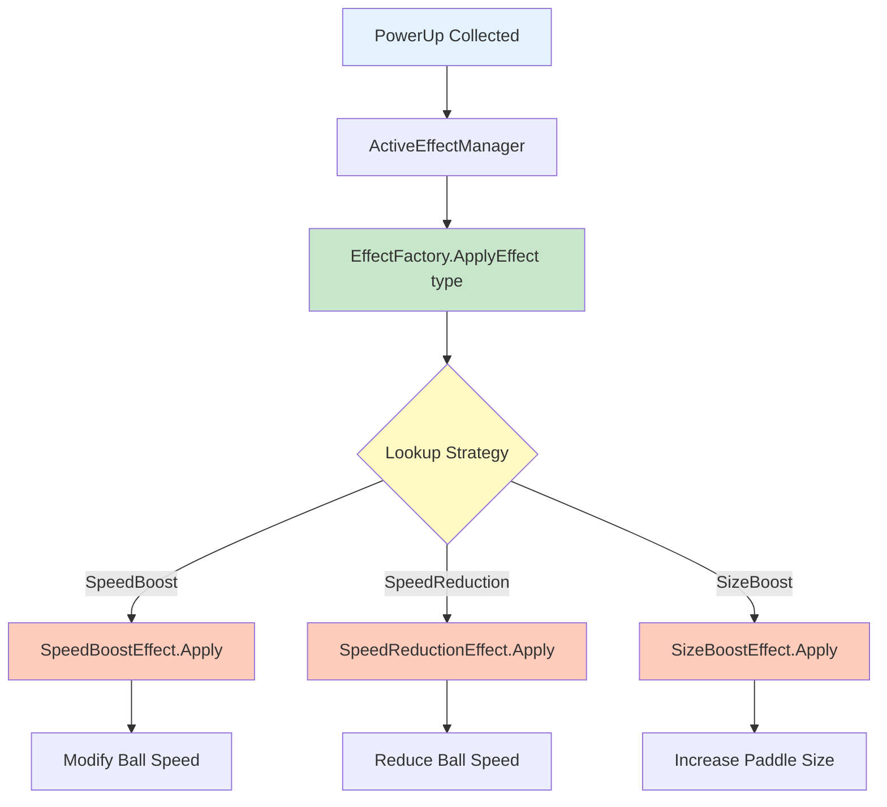

# Strategy Pattern - Effect System

## Mô tả
Strategy Pattern định nghĩa family of algorithms, đóng gói từng cái, và làm cho chúng interchangeable. Loại bỏ switch statements, tuân thủ Open/Closed Principle.

## UML Diagram



## Strategy Selection Flow



## Implementation Details

### Strategy Interface:
```csharp
public interface IEffect
{
    void Apply();
    void Remove();
}
```

### Concrete Strategies:

#### SpeedBoostEffect:
```csharp
public class SpeedBoostEffect : IEffect
{
    private readonly Ball _ball;
    private float _originalSpeed;
    
    public SpeedBoostEffect(Ball ball)
    {
        _ball = ball;
    }
    
    public void Apply()
    {
        _originalSpeed = _ball.Speed;
        _ball.SetBaseSpeed(_originalSpeed * 1.5f); // 50% faster
    }
    
    public void Remove()
    {
        _ball.SetBaseSpeed(_originalSpeed);
    }
}
```

#### SpeedReductionEffect:
```csharp
public class SpeedReductionEffect : IEffect
{
    private readonly Ball _ball;
    private float _originalSpeed;
    
    public SpeedReductionEffect(Ball ball)
    {
        _ball = ball;
    }
    
    public void Apply()
    {
        _originalSpeed = _ball.Speed;
        _ball.SetBaseSpeed(_originalSpeed * 0.5f); // 50% slower
    }
    
    public void Remove()
    {
        _ball.SetBaseSpeed(_originalSpeed);
    }
}
```

#### SizeBoostEffect:
```csharp
public class SizeBoostEffect : IEffect
{
    private readonly Paddle _leftPaddle;
    private readonly Paddle _rightPaddle;
    private int _originalHeight;
    
    public SizeBoostEffect(Paddle leftPaddle, Paddle rightPaddle)
    {
        _leftPaddle = leftPaddle;
        _rightPaddle = rightPaddle;
    }
    
    public void Apply()
    {
        _originalHeight = _leftPaddle.Height;
        _leftPaddle.Height = (int)(_originalHeight * 1.5);
        _rightPaddle.Height = (int)(_originalHeight * 1.5);
        
        _leftPaddle.Color = Color.Gold;
        _rightPaddle.Color = Color.Gold;
    }
    
    public void Remove()
    {
        _leftPaddle.Height = _originalHeight;
        _rightPaddle.Height = _originalHeight;
        
        _leftPaddle.Color = Color.White;
        _rightPaddle.Color = Color.White;
    }
}
```

### Context Class (EffectFactory):
```csharp
public class EffectFactory
{
    private readonly Dictionary<PowerUpType, IEffect> _effectStrategies;
    private readonly Ball _ball;
    private readonly Paddle _leftPaddle;
    private readonly Paddle _rightPaddle;
    
    public EffectFactory(Ball ball, Paddle leftPaddle, Paddle rightPaddle)
    {
        _ball = ball;
        _leftPaddle = leftPaddle;
        _rightPaddle = rightPaddle;
        
        _effectStrategies = new Dictionary<PowerUpType, IEffect>();
        InitializeStrategies();
    }
    
    private void InitializeStrategies()
    {
        // Map PowerUpType to Strategy
        _effectStrategies[PowerUpType.SpeedBoost] = new SpeedBoostEffect(_ball);
        _effectStrategies[PowerUpType.SpeedReduction] = new SpeedReductionEffect(_ball);
        _effectStrategies[PowerUpType.SizeBoost] = new SizeBoostEffect(_leftPaddle, _rightPaddle);
    }
    
    public IEffect GetEffect(PowerUpType type)
    {
        return _effectStrategies.ContainsKey(type) ? _effectStrategies[type] : null;
    }
    
    public void ApplyEffect(PowerUpType type)
    {
        var effect = GetEffect(type);
        effect?.Apply();
    }
    
    public void RemoveEffect(PowerUpType type)
    {
        var effect = GetEffect(type);
        effect?.Remove();
    }
    
    public void ResetAllEffects()
    {
        foreach (var effect in _effectStrategies.Values)
        {
            effect.Remove();
        }
    }
}
```

## Before vs After Strategy Pattern

### ❌ Before (Switch Statement):
```csharp
public void ApplyEffect(PowerUpType type)
{
    switch (type)
    {
        case PowerUpType.SpeedBoost:
            _originalSpeed = _ball.Speed;
            _ball.SetBaseSpeed(_originalSpeed * 1.5f);
            break;
        case PowerUpType.SpeedReduction:
            _originalSpeed = _ball.Speed;
            _ball.SetBaseSpeed(_originalSpeed * 0.5f);
            break;
        case PowerUpType.SizeBoost:
            _originalHeight = _leftPaddle.Height;
            _leftPaddle.Height = (int)(_originalHeight * 1.5);
            // ...
            break;
    }
}

// ❌ Violates Open/Closed Principle
// ❌ Violates Single Responsibility
// ❌ Hard to test individual effects
```

### ✅ After (Strategy Pattern):
```csharp
public void ApplyEffect(PowerUpType type)
{
    var effect = GetEffect(type);
    effect?.Apply();
}

// ✅ Open/Closed: Add new effects without modifying code
// ✅ Single Responsibility: Each effect in own class
// ✅ Testable: Mock/test strategies independently
```

## Adding New Effect

### Step 1: Create Strategy
```csharp
public class InvincibilityEffect : IEffect
{
    private readonly Paddle _paddle;
    
    public void Apply()
    {
        _paddle.IsInvincible = true;
        _paddle.Color = Color.Blue;
    }
    
    public void Remove()
    {
        _paddle.IsInvincible = false;
        _paddle.Color = Color.White;
    }
}
```

### Step 2: Register in Factory
```csharp
// In InitializeStrategies()
_effectStrategies[PowerUpType.Invincibility] = new InvincibilityEffect(_leftPaddle);
```

### Step 3: Done! ✅
- Không cần sửa ApplyEffect(), RemoveEffect()
- Không cần thêm switch cases
- Tuân thủ Open/Closed Principle

## Benefits:
1. ✅ **No Switch Statements**: Loại bỏ conditional logic
2. ✅ **Open/Closed**: Open for extension, closed for modification
3. ✅ **Single Responsibility**: Mỗi strategy 1 responsibility
4. ✅ **Testability**: Test từng strategy độc lập
5. ✅ **Maintainability**: Dễ dàng thêm/sửa effects
6. ✅ **Runtime Selection**: Chọn strategy runtime qua Dictionary

## Use Cases:
- 🎮 Game effects/abilities
- 💰 Payment methods
- 📊 Sorting algorithms
- 🗜️ Compression algorithms
- 🔐 Encryption strategies
