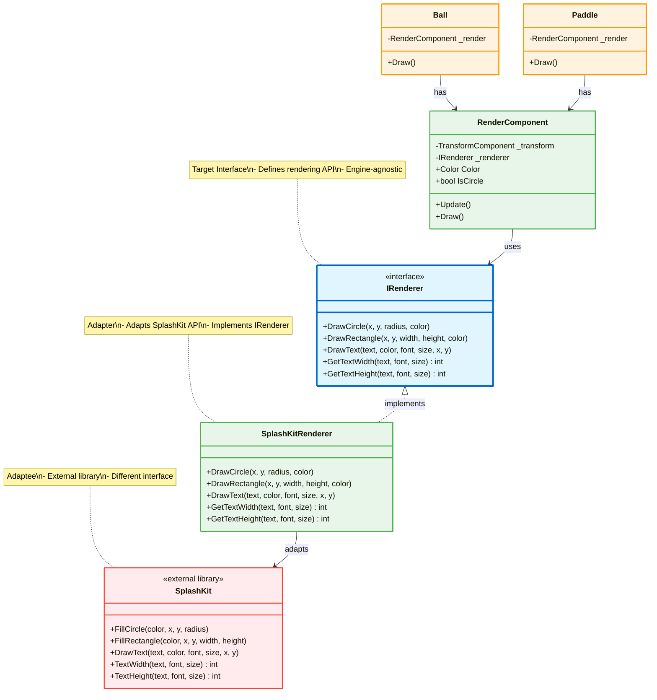
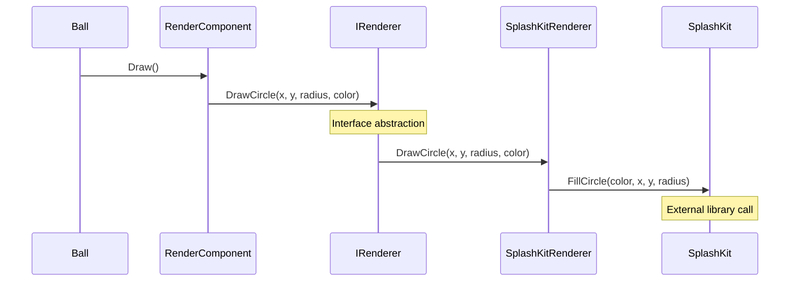

# Adapter Pattern - Rendering Abstraction

## Mô tả
Adapter Pattern cho phép objects với incompatible interfaces làm việc cùng nhau. Decouples game entities khỏi SplashKit rendering engine.

## UML Diagram



## Adapter Pattern Flow



## Before vs After Adapter

### ❌ Before (Direct Coupling):
```csharp
public class Ball
{
    public void Draw()
    {
        // Direct dependency on SplashKit
        SplashKit.FillCircle(Color.White, X, Y, Size);
    }
}

// ❌ Tight coupling to SplashKit
// ❌ Cannot swap rendering engines
// ❌ Hard to test without SplashKit
// ❌ Cannot mock for unit tests
```

### ✅ After (Adapter Pattern):
```csharp
public class Ball
{
    private RenderComponent _render;
    
    public Ball(IRenderer renderer)
    {
        _render = new RenderComponent(renderer);
    }
    
    public void Draw()
    {
        _render.Draw(); // Uses IRenderer abstraction
    }
}

// ✅ Decoupled from SplashKit
// ✅ Can swap to Unity, MonoGame, etc.
// ✅ Easy to test with mock renderer
// ✅ Dependency Inversion Principle
```

## Implementation Details

### Target Interface (IRenderer):
```csharp
public interface IRenderer
{
    void DrawCircle(float x, float y, float radius, Color color);
    void DrawRectangle(float x, float y, float width, float height, Color color);
    void DrawText(string text, Color color, string font, int size, float x, float y);
    int GetTextWidth(string text, string font, int size);
    int GetTextHeight(string text, string font, int size);
}
```

### Adapter (SplashKitRenderer):
```csharp
public class SplashKitRenderer : IRenderer
{
    public void DrawCircle(float x, float y, float radius, Color color)
    {
        // Adapt to SplashKit API (parameter order different)
        SplashKit.FillCircle(color, x, y, radius);
    }
    
    public void DrawRectangle(float x, float y, float width, float height, Color color)
    {
        // Adapt to SplashKit API
        SplashKit.FillRectangle(color, x, y, width, height);
    }
    
    public void DrawText(string text, Color color, string font, int size, float x, float y)
    {
        // Adapt to SplashKit API
        SplashKit.DrawText(text, color, font, size, x, y);
    }
    
    public int GetTextWidth(string text, string font, int size)
    {
        return SplashKit.TextWidth(text, font, size);
    }
    
    public int GetTextHeight(string text, string font, int size)
    {
        return SplashKit.TextHeight(text, font, size);
    }
}
```

### Client (RenderComponent):
```csharp
public class RenderComponent : IComponent
{
    private readonly TransformComponent _transform;
    private readonly IRenderer _renderer; // Dependency Injection
    
    public Color Color { get; set; }
    public bool IsCircle { get; set; }
    
    public RenderComponent(TransformComponent transform, IRenderer renderer)
    {
        _transform = transform;
        _renderer = renderer;
    }
    
    public void Draw()
    {
        if (IsCircle)
        {
            float radius = _transform.Width / 2;
            _renderer.DrawCircle(_transform.X, _transform.Y, radius, Color);
        }
        else
        {
            _renderer.DrawRectangle(_transform.X, _transform.Y, 
                                   _transform.Width, _transform.Height, Color);
        }
    }
    
    public void Update() { }
}
```

### Usage (Dependency Injection):
```csharp
// Setup renderer
IRenderer renderer = new SplashKitRenderer();

// Inject into entities
Ball ball = new Ball(renderer);
Paddle paddle = new Paddle(renderer);

// Can easily swap to different renderer
IRenderer unityRenderer = new UnityRenderer();
Ball ball2 = new Ball(unityRenderer);
```

## Swapping Rendering Engines

### Example: Unity Adapter
```csharp
public class UnityRenderer : IRenderer
{
    public void DrawCircle(float x, float y, float radius, Color color)
    {
        // Adapt to Unity API
        GameObject circle = GameObject.CreatePrimitive(PrimitiveType.Sphere);
        circle.transform.position = new Vector3(x, y, 0);
        circle.transform.localScale = new Vector3(radius * 2, radius * 2, 1);
        circle.GetComponent<Renderer>().material.color = color;
    }
    
    // ... other methods
}
```

### Example: Mock Renderer (Testing)
```csharp
public class MockRenderer : IRenderer
{
    public List<string> DrawCalls { get; } = new List<string>();
    
    public void DrawCircle(float x, float y, float radius, Color color)
    {
        DrawCalls.Add($"Circle: ({x}, {y}), r={radius}");
    }
    
    // ... other methods
}

// Unit Test
[Test]
public void Ball_Draw_CallsRendererDrawCircle()
{
    var mockRenderer = new MockRenderer();
    var ball = new Ball(mockRenderer);
    
    ball.Draw();
    
    Assert.That(mockRenderer.DrawCalls.Count, Is.EqualTo(1));
    Assert.That(mockRenderer.DrawCalls[0], Does.Contain("Circle"));
}
```

## Adapter vs Wrapper

### Adapter Pattern:
- ✅ Different interface (IRenderer ≠ SplashKit API)
- ✅ Makes incompatible interfaces compatible
- ✅ Adapts existing code to new interface

### Wrapper Pattern:
- 🔄 Same interface (wraps without changing)
- 🔄 Adds functionality to existing interface
- 🔄 Example: Logging wrapper, caching wrapper

## Benefits:
1. ✅ **Decoupling**: Entities không depend vào rendering engine
2. ✅ **Testability**: Dễ dàng mock renderer cho testing
3. ✅ **Flexibility**: Swap rendering engines dễ dàng
4. ✅ **Dependency Inversion**: Depend on abstraction (IRenderer)
5. ✅ **Reusability**: RenderComponent reusable với bất kỳ renderer nào
6. ✅ **Maintainability**: Thay đổi rendering không ảnh hưởng entities

## Use Cases:
- 🎨 Graphics API abstraction (DirectX, OpenGL, Vulkan)
- 🗄️ Database drivers (SQL Server, MySQL, PostgreSQL)
- 📡 API clients (REST, GraphQL, gRPC)
- 🔌 Third-party library integration
- 🧪 Testing với mock implementations
