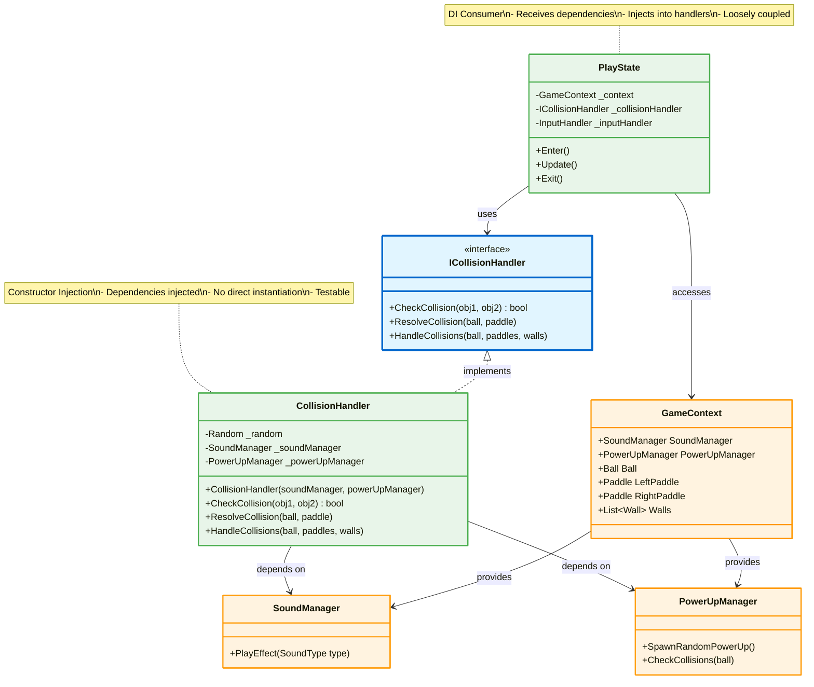
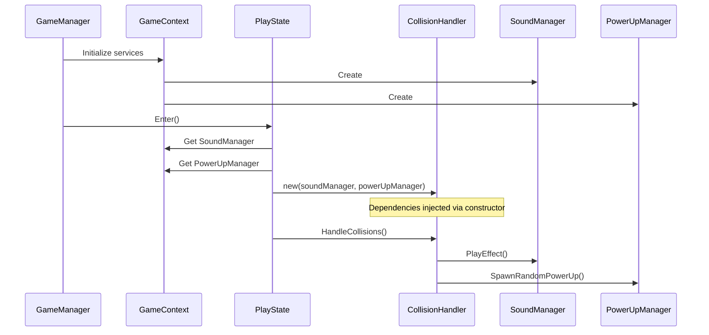

# Dependency Injection Pattern

## Mô tả
Dependency Injection là một form của Inversion of Control (IoC), cho phép objects nhận dependencies từ bên ngoài thay vì tự tạo. Giảm coupling và tăng testability.

## UML Diagram



## Dependency Injection Flow



## Types of Dependency Injection

### 1. Constructor Injection ✅ (Recommended)
```csharp
public class CollisionHandler : ICollisionHandler
{
    private readonly SoundManager _soundManager;
    private readonly PowerUpManager _powerUpManager;
    
    // Dependencies injected via constructor
    public CollisionHandler(SoundManager soundManager, PowerUpManager powerUpManager)
    {
        _soundManager = soundManager ?? throw new ArgumentNullException(nameof(soundManager));
        _powerUpManager = powerUpManager ?? throw new ArgumentNullException(nameof(powerUpManager));
    }
    
    public void HandleCollisions(Ball ball, List<Paddle> paddles, List<Wall> walls)
    {
        foreach (var paddle in paddles)
        {
            if (CheckCollision(ball, paddle))
            {
                ResolveCollision(ball, paddle);
                _soundManager.PlayEffect(SoundType.PaddleHit); // Use injected dependency
                _powerUpManager.SpawnRandomPowerUp(); // Use injected dependency
            }
        }
    }
}
```

### 2. Property Injection (Optional)
```csharp
public class ScoreSubject
{
    // Optional dependencies can be set via properties
    public SoundManager SoundManager { get; set; }
    public ActiveEffectManager ActiveEffectManager { get; set; }
    
    public void InjectDependencies(SoundManager soundManager, ActiveEffectManager effectManager)
    {
        SoundManager = soundManager;
        ActiveEffectManager = effectManager;
    }
    
    public void LeftPoint()
    {
        _scoreboard.LeftPoint();
        SoundManager?.PlayEffect(SoundType.BallOut); // Null-conditional
        ActiveEffectManager?.ClearAllEffects();
    }
}
```

### 3. Method Injection
```csharp
public class GameEntityFactory
{
    private IWallValidator _wallValidator;
    
    // Dependency injected via method parameter
    public List<Wall> CreateWalls(int windowWidth, int windowHeight, IWallValidator validator)
    {
        _wallValidator = validator;
        // Use validator
    }
}
```

## Implementation Details

### Interface Definition:
```csharp
public interface ICollisionHandler
{
    bool CheckCollision(GameObject obj1, GameObject obj2);
    void ResolveCollision(Ball ball, Paddle paddle);
    void HandleCollisions(Ball ball, List<Paddle> paddles, List<Wall> walls);
}
```

### Concrete Implementation with DI:
```csharp
public class CollisionHandler : ICollisionHandler
{
    private readonly Random _random;
    private readonly SoundManager _soundManager;
    private readonly PowerUpManager _powerUpManager;
    
    // Constructor Injection
    public CollisionHandler(SoundManager soundManager, PowerUpManager powerUpManager)
    {
        _random = new Random();
        _soundManager = soundManager ?? throw new ArgumentNullException(nameof(soundManager));
        _powerUpManager = powerUpManager ?? throw new ArgumentNullException(nameof(powerUpManager));
    }
    
    public bool CheckCollision(GameObject obj1, GameObject obj2)
    {
        var bounds1 = obj1.GetComponent<CollisionComponent>().GetBounds();
        var bounds2 = obj2.GetComponent<CollisionComponent>().GetBounds();
        return bounds1.Intersects(bounds2);
    }
    
    public void ResolveCollision(Ball ball, Paddle paddle)
    {
        // Collision resolution logic
        float relativeIntersectY = (paddle.Y + paddle.Height / 2) - ball.Y;
        float normalizedIntersect = relativeIntersectY / (paddle.Height / 2);
        float bounceAngle = normalizedIntersect * (float)(Math.PI / 4);
        
        float speed = ball.Speed;
        ball.Velocity = new Vector2D
        {
            X = paddle.X < 400 ? speed * (float)Math.Cos(bounceAngle) : -speed * (float)Math.Cos(bounceAngle),
            Y = -speed * (float)Math.Sin(bounceAngle)
        };
        
        // Use injected dependencies
        _soundManager.PlayEffect(SoundType.PaddleHit);
        
        if (_random.Next(0, 100) < 20) // 20% chance
        {
            _powerUpManager.SpawnRandomPowerUp();
        }
    }
    
    public void HandleCollisions(Ball ball, List<Paddle> paddles, List<Wall> walls)
    {
        foreach (var paddle in paddles)
        {
            if (CheckCollision(ball, paddle))
            {
                ResolveCollision(ball, paddle);
            }
        }
        
        foreach (var wall in walls)
        {
            if (CheckCollision(ball, wall))
            {
                ball.Bounce();
                _soundManager.PlayEffect(SoundType.WallHit);
            }
        }
    }
}
```

### DI Consumer (PlayState):
```csharp
public class PlayState : IGameState
{
    private readonly GameContext _context;
    private ICollisionHandler _collisionHandler;
    private InputHandler _inputHandler;
    
    public PlayState(GameContext context)
    {
        _context = context;
    }
    
    public void Enter()
    {
        // Retrieve dependencies from context
        var soundManager = _context.Services.SoundManager;
        var powerUpManager = _context.Services.PowerUpManager;
        
        // Inject dependencies via constructor
        _collisionHandler = new CollisionHandler(soundManager, powerUpManager);
        
        // Initialize input handler
        _inputHandler = new InputHandler(_context.Entities.LeftPaddle, _context.Entities.RightPaddle);
    }
    
    public void Update()
    {
        _inputHandler.HandleKeyInput();
        _inputHandler.UpdatePaddleMovement();
        
        // Use injected collision handler
        _collisionHandler.HandleCollisions(
            _context.Entities.Ball,
            new List<Paddle> { _context.Entities.LeftPaddle, _context.Entities.RightPaddle },
            _context.Entities.Walls
        );
    }
    
    public void Exit()
    {
        _collisionHandler = null;
    }
}
```

## Before vs After DI

### ❌ Before (Tight Coupling):
```csharp
public class CollisionHandler
{
    private SoundManager _soundManager;
    private PowerUpManager _powerUpManager;
    
    public CollisionHandler()
    {
        // Creates dependencies itself - tight coupling
        _soundManager = new SoundManager();
        _powerUpManager = new PowerUpManager(800, 600);
    }
    
    // ❌ Hard to test (cannot mock dependencies)
    // ❌ Tight coupling to concrete implementations
    // ❌ Cannot reuse with different SoundManager
}
```

### ✅ After (Dependency Injection):
```csharp
public class CollisionHandler
{
    private readonly SoundManager _soundManager;
    private readonly PowerUpManager _powerUpManager;
    
    public CollisionHandler(SoundManager soundManager, PowerUpManager powerUpManager)
    {
        _soundManager = soundManager;
        _powerUpManager = powerUpManager;
    }
    
    // ✅ Easy to test (inject mock dependencies)
    // ✅ Loose coupling to abstractions
    // ✅ Reusable with any SoundManager implementation
}
```

## Unit Testing with DI

```csharp
[TestClass]
public class CollisionHandlerTests
{
    [TestMethod]
    public void ResolveCollision_PlaysPaddleHitSound()
    {
        // Arrange
        var mockSoundManager = new MockSoundManager();
        var mockPowerUpManager = new MockPowerUpManager();
        var handler = new CollisionHandler(mockSoundManager, mockPowerUpManager);
        
        var ball = new Ball(400, 300, 800, 600);
        var paddle = new Paddle(50, 250, 600, true);
        
        // Act
        handler.ResolveCollision(ball, paddle);
        
        // Assert
        Assert.IsTrue(mockSoundManager.EffectsPlayed.Contains(SoundType.PaddleHit));
    }
}

public class MockSoundManager : SoundManager
{
    public List<SoundType> EffectsPlayed { get; } = new List<SoundType>();
    
    public override void PlayEffect(SoundType type)
    {
        EffectsPlayed.Add(type);
    }
}
```

## Benefits:
1. ✅ **Loose Coupling**: Classes không depend vào concrete implementations
2. ✅ **Testability**: Dễ dàng inject mock/stub dependencies
3. ✅ **Flexibility**: Swap implementations dễ dàng
4. ✅ **Maintainability**: Thay đổi dependencies không ảnh hưởng consumers
5. ✅ **Reusability**: Classes reusable với different dependencies
6. ✅ **Dependency Inversion**: Depend on abstractions, not concretions

## SOLID Principles:
- **D** in SOLID: Dependency Inversion Principle
  - High-level modules should not depend on low-level modules
  - Both should depend on abstractions
  - Abstractions should not depend on details

## DI Container (Optional):
```csharp
// Manual DI (current approach)
var soundManager = new SoundManager();
var powerUpManager = new PowerUpManager(800, 600);
var collisionHandler = new CollisionHandler(soundManager, powerUpManager);

// With DI Container (e.g., Microsoft.Extensions.DependencyInjection)
services.AddSingleton<SoundManager>();
services.AddSingleton<PowerUpManager>();
services.AddTransient<ICollisionHandler, CollisionHandler>();

var collisionHandler = serviceProvider.GetService<ICollisionHandler>();
```
