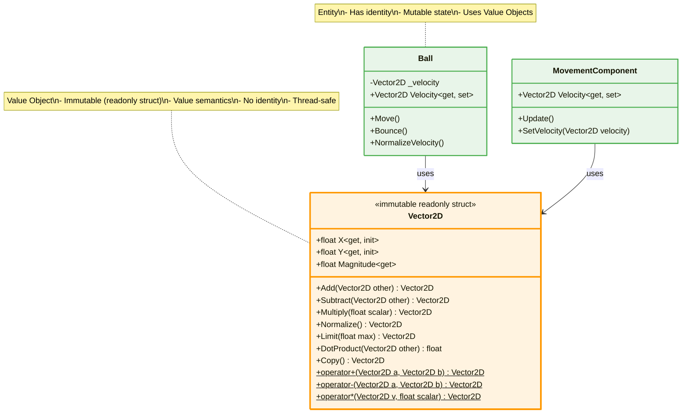
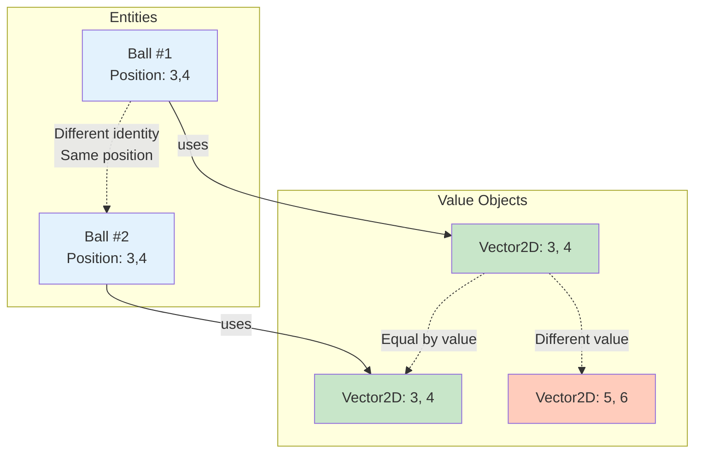

# Value Object Pattern - Vector2D

## Mô tả
Value Object Pattern định nghĩa objects được identified bởi value, không phải identity. Immutable, thread-safe, và có value semantics.

## UML Diagram



## Value Object vs Entity



## Implementation Details

### Vector2D as Immutable Struct:
```csharp
public readonly struct Vector2D : IEquatable<Vector2D>
{
    // Properties with init-only setters (immutable)
    public float X { get; init; }
    public float Y { get; init; }
    
    // Computed property
    public float Magnitude => (float)Math.Sqrt(X * X + Y * Y);
    
    // Constructor
    public Vector2D(float x, float y)
    {
        X = x;
        Y = y;
    }
    
    // Immutable operations - return new instances
    public Vector2D Add(Vector2D other)
    {
        return new Vector2D(X + other.X, Y + other.Y);
    }
    
    public Vector2D Subtract(Vector2D other)
    {
        return new Vector2D(X - other.X, Y - other.Y);
    }
    
    public Vector2D Multiply(float scalar)
    {
        return new Vector2D(X * scalar, Y * scalar);
    }
    
    public Vector2D Normalize()
    {
        float mag = Magnitude;
        if (mag == 0) return this;
        return new Vector2D(X / mag, Y / mag);
    }
    
    public Vector2D Limit(float max)
    {
        if (Magnitude <= max) return this;
        return Normalize().Multiply(max);
    }
    
    public float DotProduct(Vector2D other)
    {
        return X * other.X + Y * other.Y;
    }
    
    public Vector2D Copy()
    {
        return new Vector2D(X, Y);
    }
    
    // Operator overloading for natural syntax
    public static Vector2D operator +(Vector2D a, Vector2D b)
    {
        return a.Add(b);
    }
    
    public static Vector2D operator -(Vector2D a, Vector2D b)
    {
        return a.Subtract(b);
    }
    
    public static Vector2D operator *(Vector2D v, float scalar)
    {
        return v.Multiply(scalar);
    }
    
    public static Vector2D operator *(float scalar, Vector2D v)
    {
        return v.Multiply(scalar);
    }
    
    // Value equality
    public bool Equals(Vector2D other)
    {
        return X == other.X && Y == other.Y;
    }
    
    public override bool Equals(object obj)
    {
        return obj is Vector2D other && Equals(other);
    }
    
    public override int GetHashCode()
    {
        return HashCode.Combine(X, Y);
    }
    
    public static bool operator ==(Vector2D left, Vector2D right)
    {
        return left.Equals(right);
    }
    
    public static bool operator !=(Vector2D left, Vector2D right)
    {
        return !left.Equals(right);
    }
    
    public override string ToString()
    {
        return $"({X}, {Y})";
    }
}
```

## Usage Examples

### Creating Value Objects:
```csharp
// Using constructor
Vector2D velocity = new Vector2D(5, 3);

// Using init properties
Vector2D direction = new Vector2D { X = 1, Y = 0 };

// Computed property
float speed = velocity.Magnitude; // sqrt(5^2 + 3^2) = 5.83
```

### Immutable Operations:
```csharp
Vector2D v1 = new Vector2D(3, 4);
Vector2D v2 = new Vector2D(1, 2);

// Operations return NEW instances
Vector2D sum = v1.Add(v2);        // (4, 6)
Vector2D diff = v1.Subtract(v2);  // (2, 2)
Vector2D scaled = v1.Multiply(2); // (6, 8)

// Original values unchanged
Console.WriteLine(v1); // (3, 4) - still unchanged
```

### Operator Overloading:
```csharp
Vector2D v1 = new Vector2D(3, 4);
Vector2D v2 = new Vector2D(1, 2);

// Natural mathematical syntax
Vector2D sum = v1 + v2;      // (4, 6)
Vector2D diff = v1 - v2;     // (2, 2)
Vector2D scaled = v1 * 2;    // (6, 8)
Vector2D scaled2 = 2 * v1;   // (6, 8)
```

### Ball Movement with Vector2D:
```csharp
public class Ball
{
    private Vector2D _velocity;
    private TransformComponent _transform;
    
    public Vector2D Velocity
    {
        get => _velocity;
        set => _velocity = value.Normalize(); // Always normalized
    }
    
    public void Move()
    {
        // Immutable vector math
        Vector2D displacement = _velocity * Speed;
        
        _transform.X += displacement.X;
        _transform.Y += displacement.Y;
    }
    
    public void Bounce()
    {
        // Create new velocity vector (immutable)
        _velocity = new Vector2D
        {
            X = _velocity.X,
            Y = -_velocity.Y
        };
    }
    
    public void NormalizeVelocity()
    {
        // Normalize returns new instance
        _velocity = _velocity.Normalize();
    }
    
    public void LimitSpeed(float maxSpeed)
    {
        // Limit returns new instance
        _velocity = _velocity.Limit(maxSpeed);
    }
}
```

## Value Semantics vs Reference Semantics

### Value Semantics (Vector2D - struct):
```csharp
Vector2D v1 = new Vector2D(3, 4);
Vector2D v2 = v1; // COPIED by value

v2 = new Vector2D(5, 6); // v2 changes

Console.WriteLine(v1); // (3, 4) - UNCHANGED
Console.WriteLine(v2); // (5, 6) - CHANGED
```

### Reference Semantics (class):
```csharp
Ball b1 = new Ball(100, 100, 800, 600);
Ball b2 = b1; // COPIED by reference (same object)

b2.X = 200; // Modifies same object

Console.WriteLine(b1.X); // 200 - CHANGED (same object)
Console.WriteLine(b2.X); // 200 - CHANGED
```

## Struct vs Class for Value Objects

### Why readonly struct? ✅
```csharp
public readonly struct Vector2D
{
    public float X { get; init; }
    public float Y { get; init; }
}

// ✅ Value semantics (copied by value)
// ✅ Immutable (readonly)
// ✅ Stack allocated (performance)
// ✅ No heap allocations
// ✅ No garbage collection overhead
// ✅ Thread-safe (immutable)
```

### Why NOT class? ❌
```csharp
public class Vector2D
{
    public float X { get; set; }
    public float Y { get; set; }
}

// ❌ Reference semantics (unexpected behavior)
// ❌ Mutable (can be modified)
// ❌ Heap allocated (GC overhead)
// ❌ Not thread-safe
```

## Benefits of Value Objects:

### 1. Immutability:
```csharp
Vector2D v = new Vector2D(3, 4);
// v.X = 5; // ❌ Compile error - init-only

// Must create new instance
v = new Vector2D { X = 5, Y = 4 }; // ✅
```

### 2. Thread Safety:
```csharp
// Multiple threads can safely read same Vector2D
public class Ball
{
    private Vector2D _velocity; // Thread-safe (immutable)
    
    public Vector2D Velocity => _velocity; // Safe to return
}
```

### 3. Value Equality:
```csharp
Vector2D v1 = new Vector2D(3, 4);
Vector2D v2 = new Vector2D(3, 4);

Console.WriteLine(v1 == v2); // true (value equality)
Console.WriteLine(v1.Equals(v2)); // true
```

### 4. Natural Math Operations:
```csharp
// Physics calculation
Vector2D acceleration = new Vector2D(0, -9.8f);
Vector2D velocity = new Vector2D(10, 5);
Vector2D position = new Vector2D(0, 0);

// Update physics
velocity = velocity + acceleration * deltaTime;
position = position + velocity * deltaTime;
```

## Common Value Object Patterns:

### 1. Position/Point:
```csharp
public readonly struct Position
{
    public float X { get; init; }
    public float Y { get; init; }
}
```

### 2. Color:
```csharp
public readonly struct Color
{
    public byte R { get; init; }
    public byte G { get; init; }
    public byte B { get; init; }
    public byte A { get; init; }
}
```

### 3. Money:
```csharp
public readonly struct Money
{
    public decimal Amount { get; init; }
    public string Currency { get; init; }
}
```

### 4. DateRange:
```csharp
public readonly struct DateRange
{
    public DateTime Start { get; init; }
    public DateTime End { get; init; }
}
```

## Benefits:
1. ✅ **Immutability**: Không thể modify sau khi tạo
2. ✅ **Thread Safety**: An toàn với multi-threading
3. ✅ **Value Semantics**: So sánh bằng value, không phải identity
4. ✅ **Performance**: Stack allocated, no GC pressure
5. ✅ **Natural Syntax**: Operator overloading cho math operations
6. ✅ **No Side Effects**: Operations không modify original value

## When to Use:
- 📐 Mathematical vectors (position, velocity, direction)
- 🎨 Colors, dimensions, coordinates
- 💰 Money, currency values
- 📅 Date ranges, time periods
- 📏 Measurements (distance, weight, temperature)
- 🔢 Any data identified by VALUE, not IDENTITY
