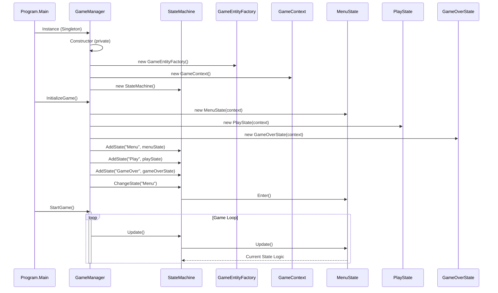
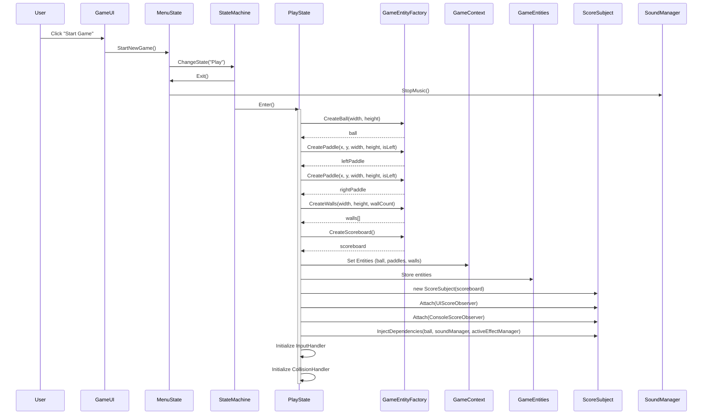
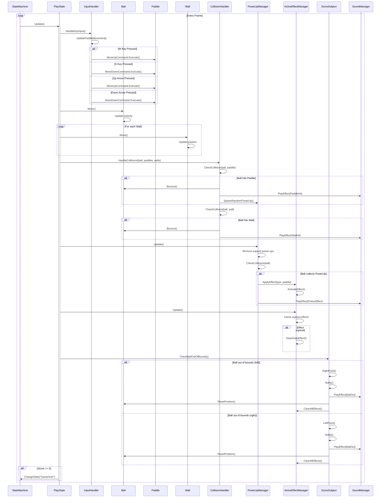
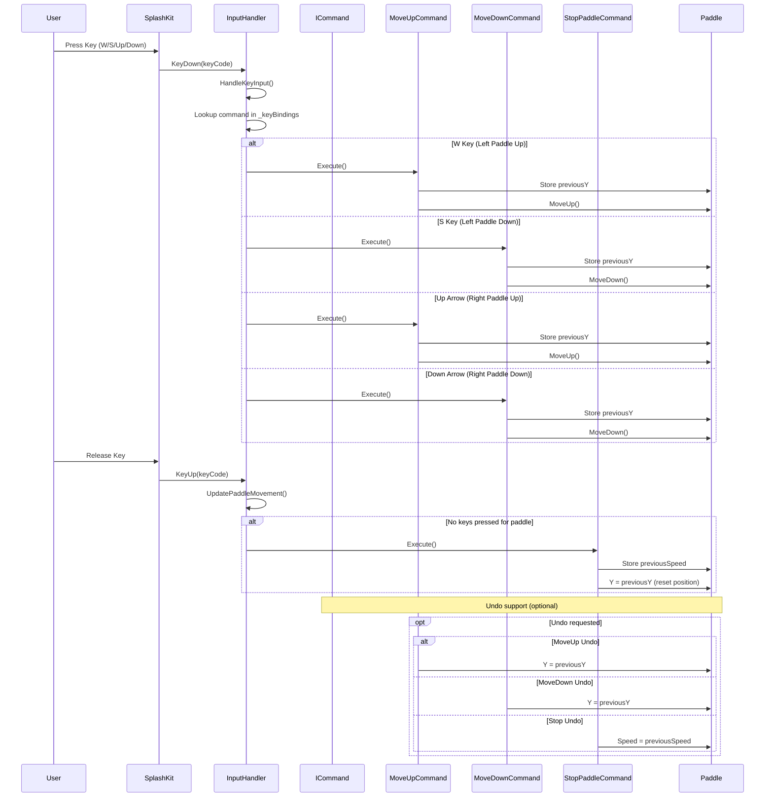
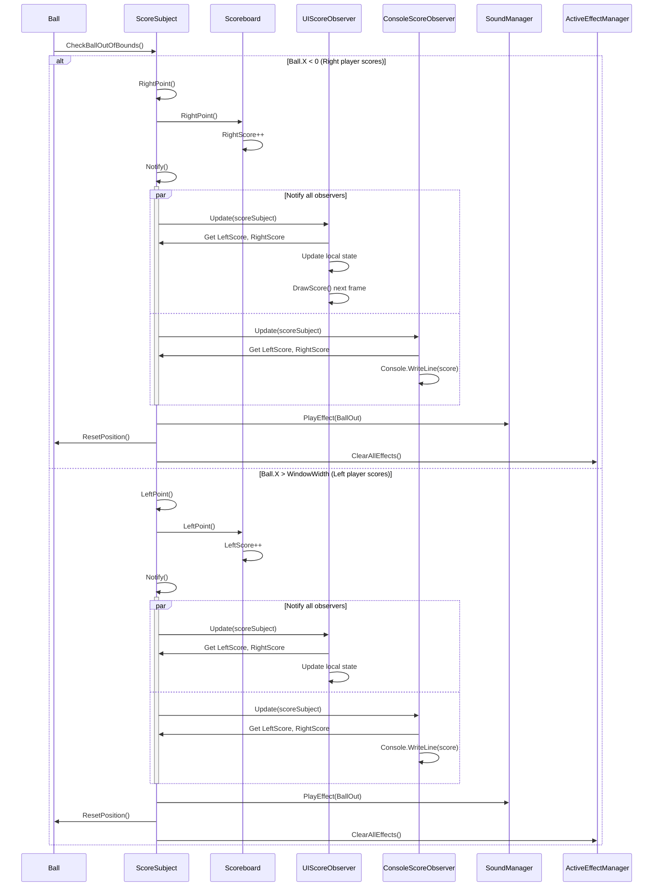
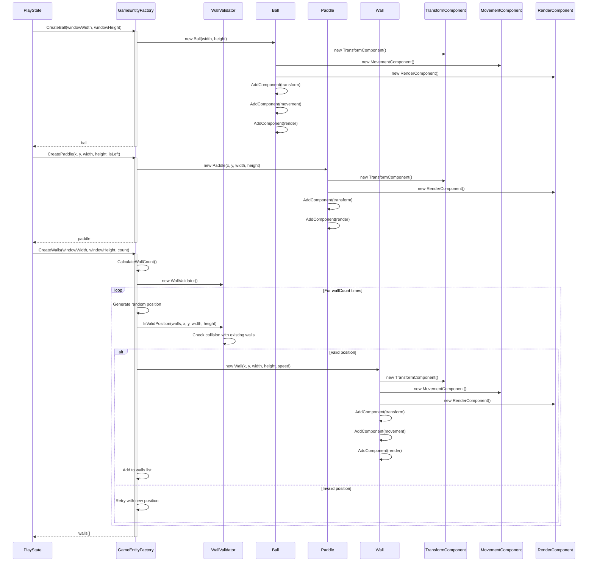
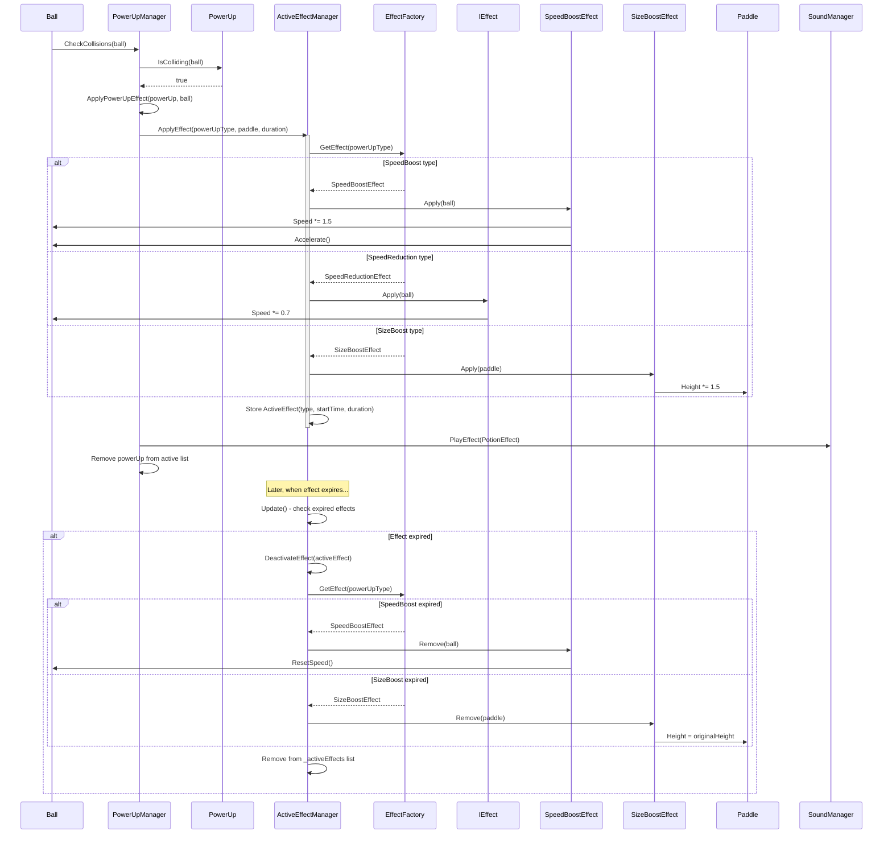
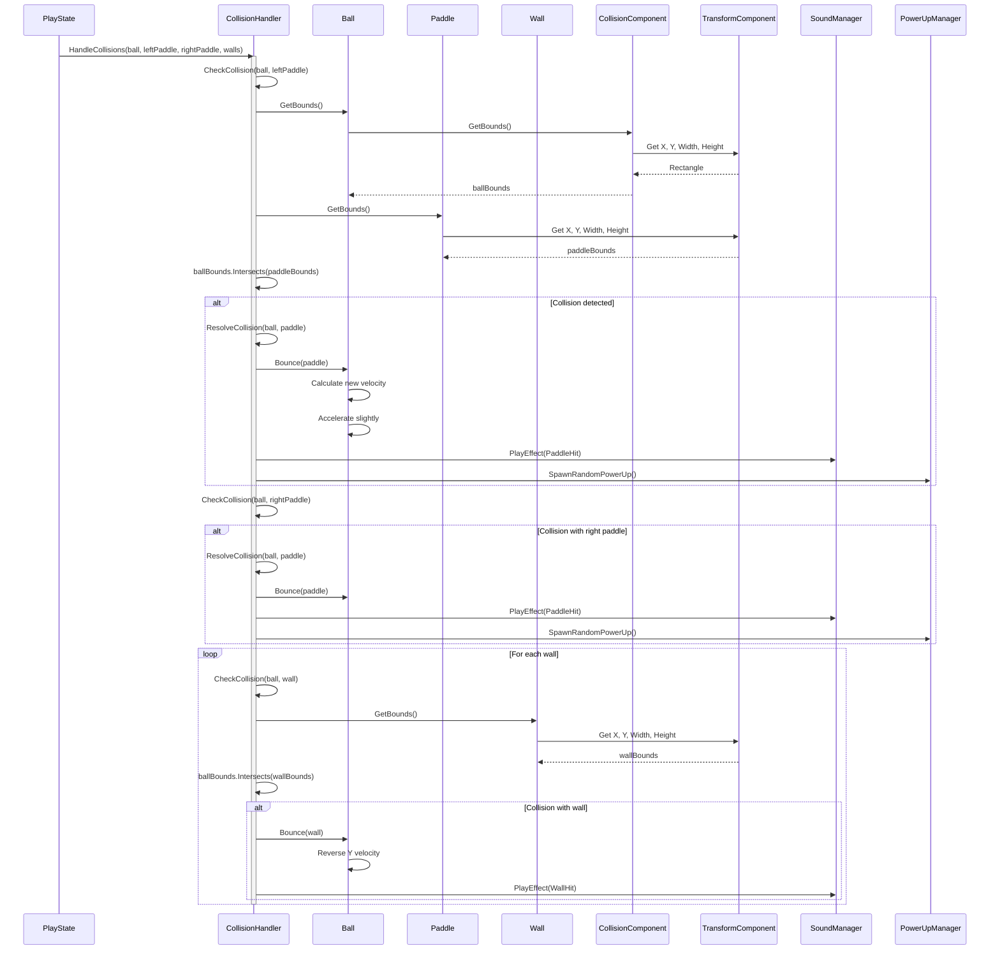
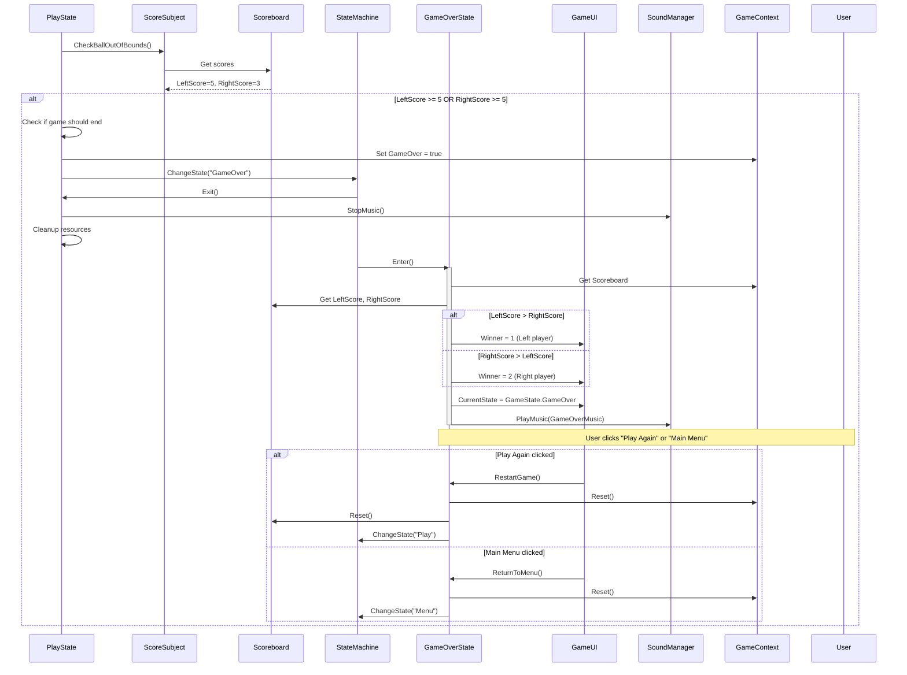
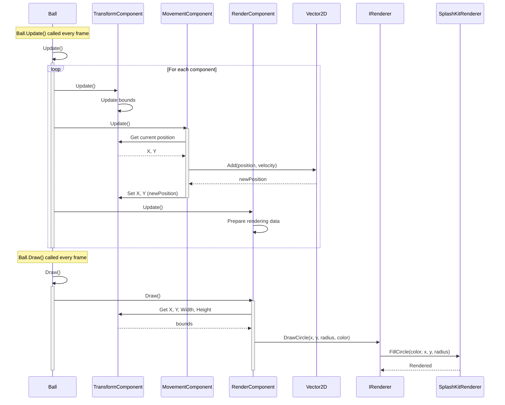

# Pong Game - Sequence Diagrams

## 1. Game Initialization Sequence

## 2. Start New Game Sequence

## 3. Gameplay Loop Sequence

## 4. Input Command Pattern Sequence

## 5. Observer Pattern - Score Update Sequence

## 6. Factory Pattern - Entity Creation Sequence

## 7. Strategy Pattern - Power-Up Effect Application Sequence

## 8. Collision Detection Sequence

## 9. State Transition - Game Over Sequence

## 10. Component Pattern - Entity Update Sequence

## Key Patterns Demonstrated

### 1. **Singleton Pattern** - GameManager ensures single instance
### 2. **State Pattern** - Clean state transitions (Menu → Play → GameOver)
### 3. **Observer Pattern** - Score updates notify multiple observers
### 4. **Command Pattern** - Input handling with undo support
### 5. **Factory Pattern** - Centralized entity creation with validation
### 6. **Strategy Pattern** - Flexible power-up effects with effect strategies
### 7. **Component Pattern** - Modular entity behavior (Transform, Movement, Render)
### 8. **Dependency Injection** - Services injected into managers
### 9. **Adapter Pattern** - IRenderer abstracts SplashKit implementation
### 10. **Immutable Value Objects** - Vector2D ensures thread-safe operations

---

## Luồng chính của Game

1. **Initialization**: Program → GameManager → StateMachine → MenuState
2. **Start Game**: MenuState → PlayState → Factory creates entities → Initialize services
3. **Gameplay Loop**: InputHandler → Update entities → CollisionHandler → PowerUpManager → ScoreSubject
4. **Score Update**: ScoreSubject notifies observers → UI updates → Check win condition
5. **Game Over**: Transition to GameOverState → Display winner → Restart or Menu
6. **Commands**: User input → Command objects → Execute on entities
7. **Effects**: PowerUp collision → ActiveEffectManager → Strategy pattern applies effect → Auto-remove when expired
8. **Components**: Entity.Update() → Update all components → Render components draw to screen
