# UML Class Diagram - Pong Game Project (Mermaid)

## Design Patterns Overview

This project implements 7 core design patterns: Singleton, State, Component, Decorator, Factory, Observer, and Command.

---

## 1. Singleton Pattern - GameManager

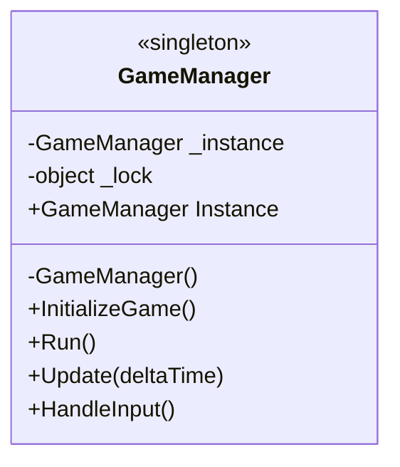

---

## 2. State Pattern

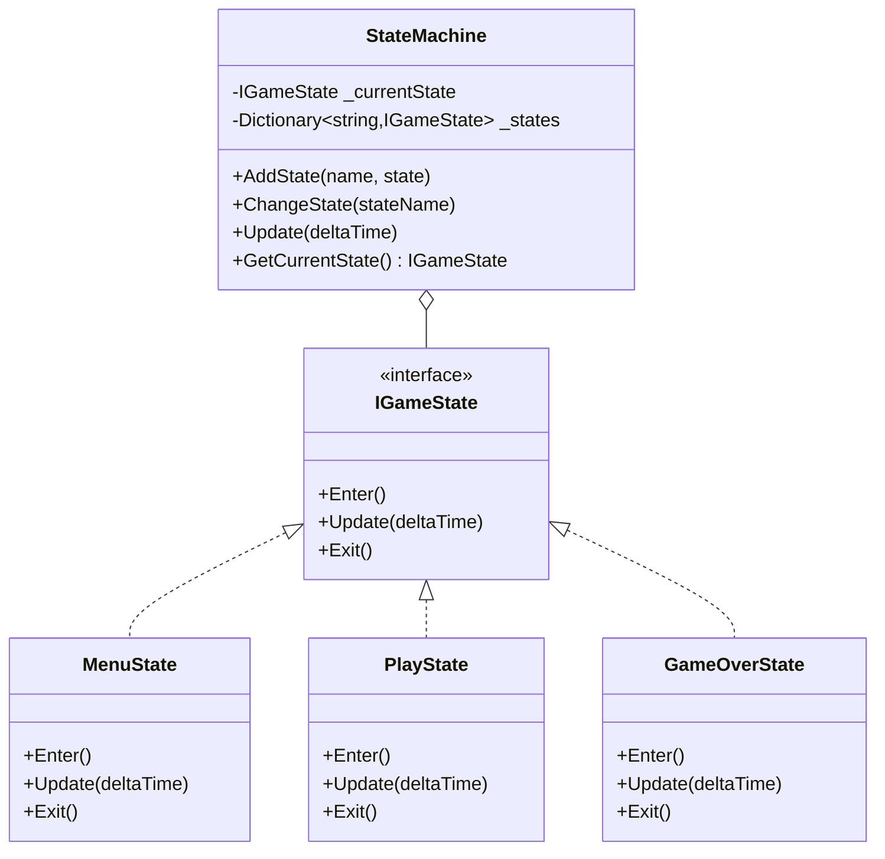

---

## 3. Component Pattern

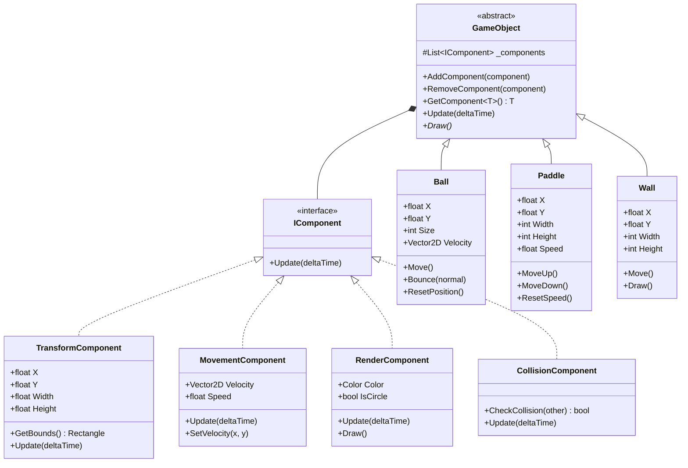

---

## 4. Decorator Pattern

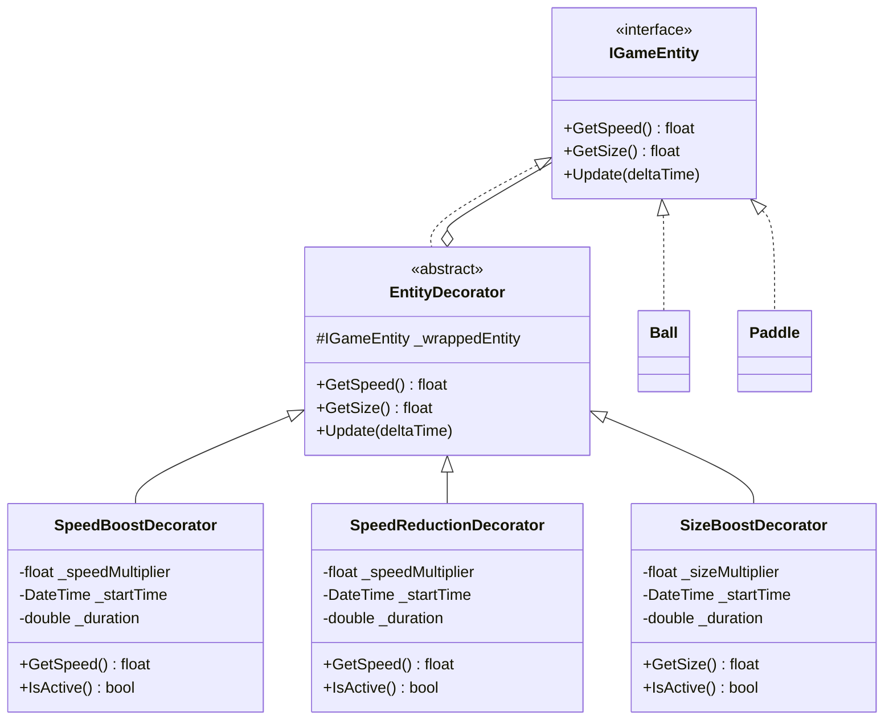

---

## 5. Factory Pattern

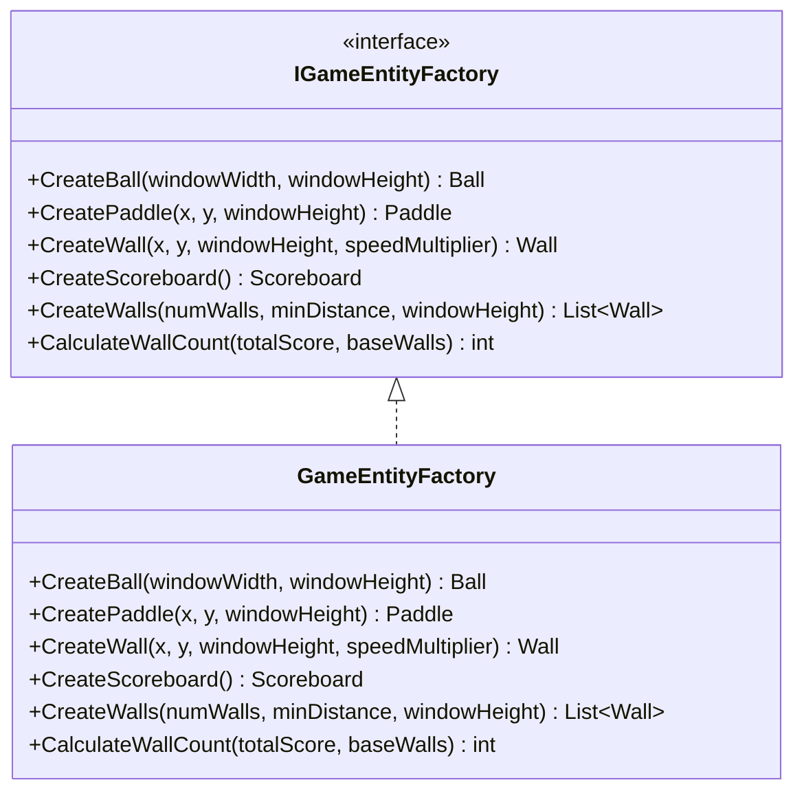

---

## 6. Observer Pattern

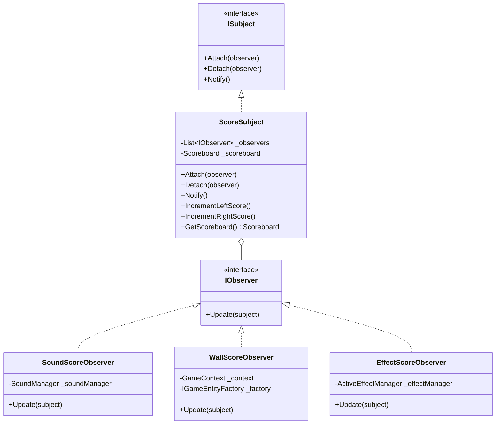

---

## 7. Command Pattern

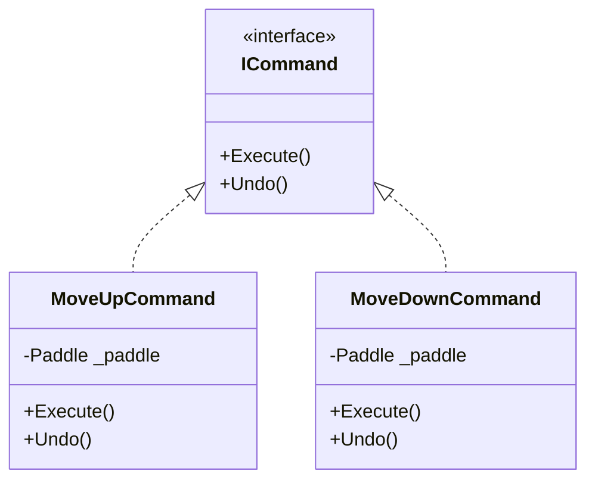

---

## Complete System Architecture

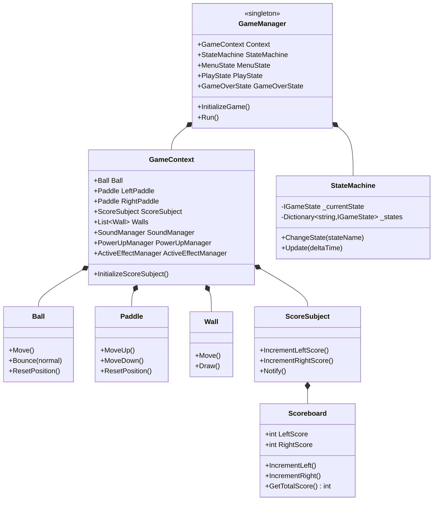

---

## Core Entities

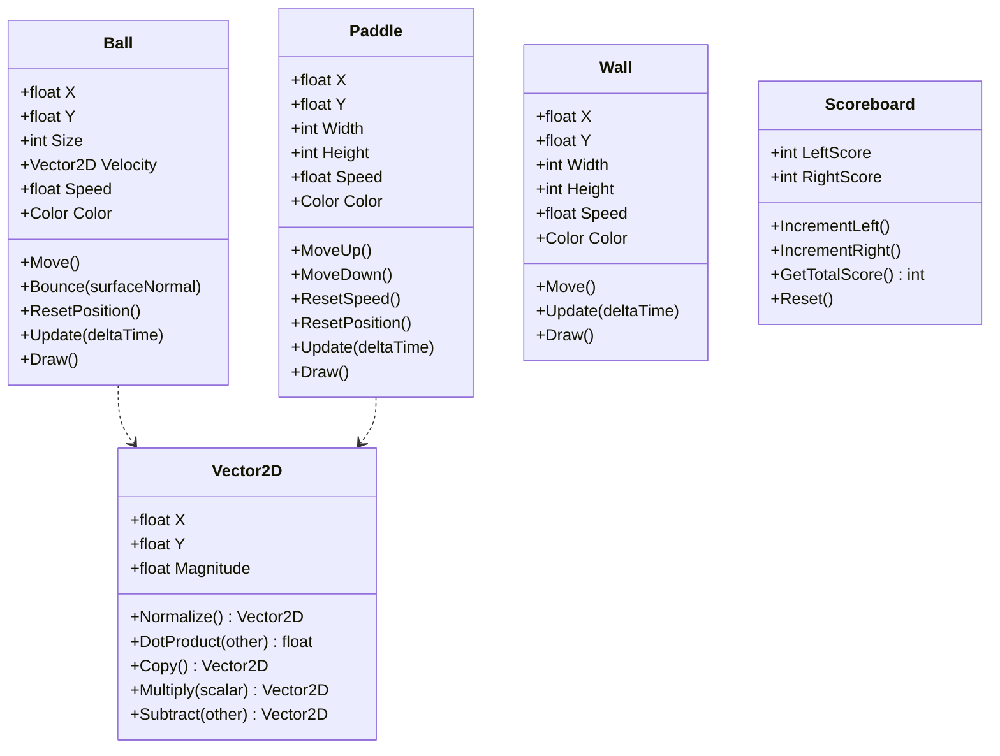

---

## Services & Managers

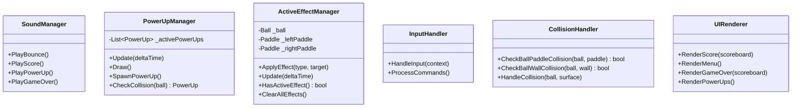

---

## Sequence Diagram - Game Flow

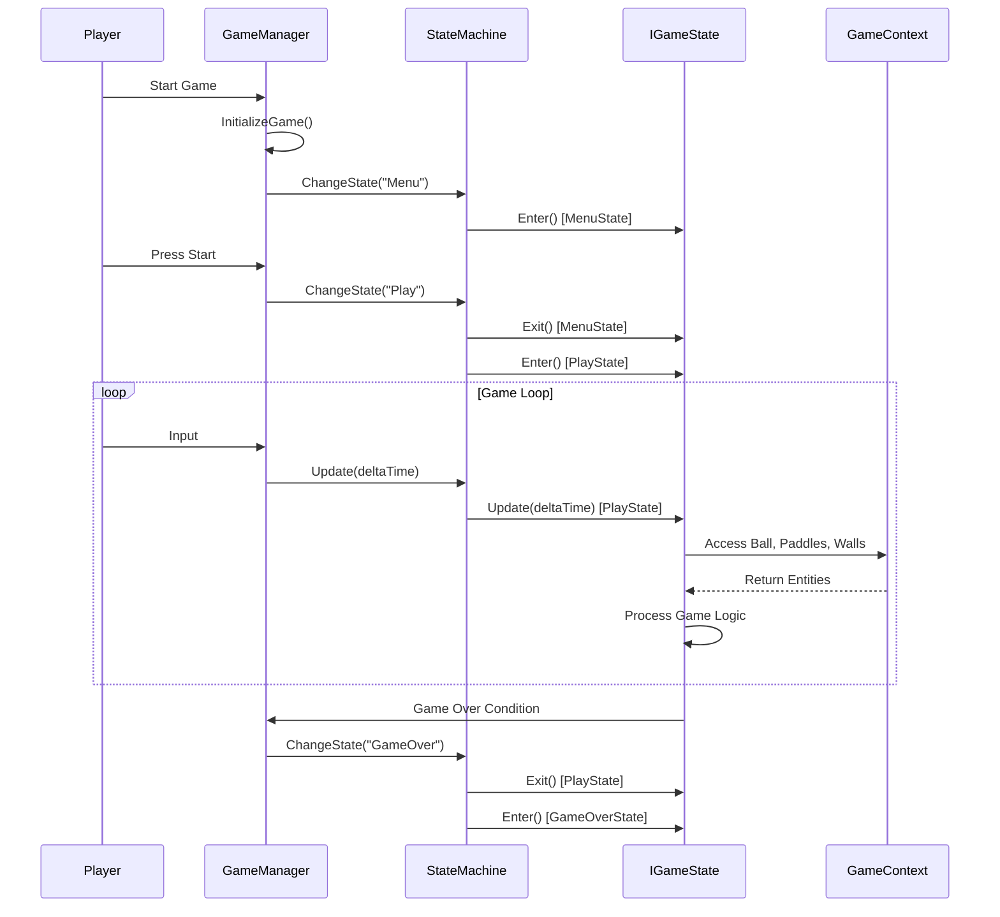

---

## State Transition Diagram

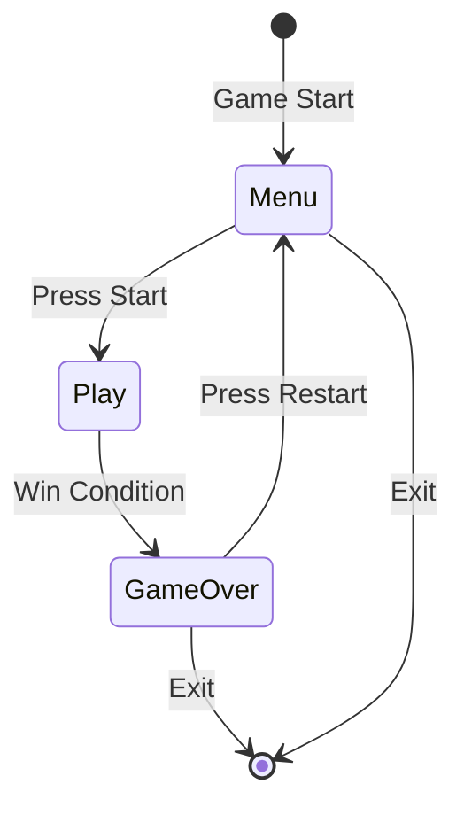

---

## Component Composition

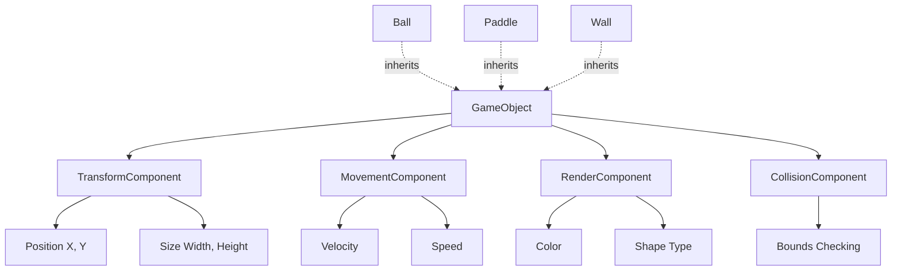

---

## Observer Pattern Flow

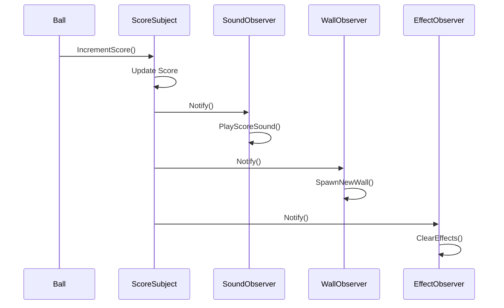

---

## Design Patterns Summary

| Pattern | Purpose | Key Classes |
|---------|---------|-------------|
| **Singleton** | Single game instance | `GameManager` |
| **State** | Game state management | `IGameState`, `StateMachine`, `MenuState`, `PlayState`, `GameOverState` |
| **Component** | Modular entity composition | `IComponent`, `GameObject`, `TransformComponent`, `MovementComponent`, `RenderComponent` |
| **Decorator** | Dynamic ability addition | `IGameEntity`, `EntityDecorator`, `SpeedBoostDecorator`, `SizeBoostDecorator` |
| **Factory** | Entity creation | `IGameEntityFactory`, `GameEntityFactory` |
| **Observer** | Event notification | `IObserver`, `ISubject`, `ScoreSubject`, `SoundScoreObserver`, `WallScoreObserver` |
| **Command** | Input encapsulation | `ICommand`, `MoveUpCommand`, `MoveDownCommand` |

---

**Generated**: October 10, 2025  
**Project**: C# Pong Game with Design Patterns  
**Framework**: .NET 8.0 with SplashKit  
**Diagrams**: Mermaid (GitHub Compatible)
