# UML Diagrams - Pong Game Project

## 1. Class Diagram - Overall Architecture

```mermaid
classDiagram
    %% Core Classes
    class Program {
        <<static>>
        +Main()
    }
    
    class GameManager {
        <<Singleton>>
        -_instance: GameManager
        -_lock: object
        -_factory: GameEntityFactory
        +Context: GameContext
        +StateMachine: StateMachine
        +Instance: GameManager
        +InitializeGame()
        +Update(deltaTime)
        +Render()
        +HandleMenuInput()
    }
    
    class GameContext {
        +Entities: GameEntities
        +Services: GameServices
        +ScoreSubject: ScoreSubject
        +WindowWidth: int
        +WindowHeight: int
        +InitializeScoreSubject()
    }
    
    %% Combine Pattern - Aggregation Classes
    class GameEntities {
        +Ball: Ball
        +LeftPaddle: Paddle
        +RightPaddle: Paddle
        +Walls: List~Wall~
        +ResetPositions()
    }
    
    class GameServices {
        +SoundManager: SoundManager
        +PowerUpManager: PowerUpManager
        +ActiveEffectManager: ActiveEffectManager
        +CollisionHandler: CollisionHandler
        +InputHandler: InputHandler
        +ClearAll()
    }
    
    class StateMachine {
        -_currentState: IGameState
        +CurrentState: IGameState
        +ChangeState(newState)
        +Update(deltaTime)
    }
    
    %% State Pattern
    class IGameState {
        <<interface>>
        +Enter()
        +Update(deltaTime)
        +Exit()
    }
    
    class MenuState {
        -_context: GameContext
        -_stateMachine: StateMachine
        +Enter()
        +Update(deltaTime)
        +Exit()
    }
    
    class PlayState {
        -_context: GameContext
        -_stateMachine: StateMachine
        -_collisionHandler: CollisionHandler
        -_inputHandler: InputHandler
        +Enter()
        +Update(deltaTime)
        +Exit()
    }
    
    class GameOverState {
        -_context: GameContext
        -_stateMachine: StateMachine
        +Enter()
        +Update(deltaTime)
        +Exit()
    }
    
    %% Component Pattern
    class IComponent {
        <<interface>>
        +Update(deltaTime)
    }
    
    class GameObject {
        <<abstract>>
        #_components: List~IComponent~
        +AddComponent(component)
        +RemoveComponent(component)
        +GetComponent~T~()
        +Update(deltaTime)
        +Draw()*
    }
    
    class TransformComponent {
        +X: float
        +Y: float
        +Width: float
        +Height: float
        +Update(deltaTime)
    }
    
    class MovementComponent {
        -_transform: TransformComponent
        -_speed: float
        +Update(deltaTime)
    }
    
    class RenderComponent {
        -_transform: TransformComponent
        -_color: Color
        -_isCircle: bool
        +Update(deltaTime)
    }
    
    %% Entities
    class Ball {
        -_transform: TransformComponent
        -_movement: MovementComponent
        -_render: RenderComponent
        -_velocity: Vector2D
        -_speed: float
        +X: float
        +Y: float
        +Size: int
        +Move()
        +Bounce(surfaceNormal)
        +ResetPosition()
        +Draw()
    }
    
    class Paddle {
        -_transform: TransformComponent
        -_render: RenderComponent
        -_speed: float
        +X: float
        +Y: float
        +Width: int
        +Height: int
        +MoveUp()
        +MoveDown()
        +ResetSpeed()
        +Draw()
    }
    
    class Wall {
        +X: float
        +Y: float
        +Width: float
        +Height: float
        +GetNormal(): Vector2D
        +IsColliding(ball): bool
        +Draw()
    }
    
    %% Command Pattern
    class ICommand {
        <<interface>>
        +Execute()
        +Undo()
    }
    
    class MoveUpCommand {
        -_paddle: Paddle
        +Execute()
        +Undo()
    }
    
    class MoveDownCommand {
        -_paddle: Paddle
        +Execute()
        +Undo()
    }
    
    %% Factory Pattern
    class GameEntityFactory {
        +CreateBall(width, height): Ball
        +CreatePaddle(x, y, height): Paddle
        +CreateScoreboard(): Scoreboard
        +CreateWalls(num, distance, height): List~Wall~
    }
    
    %% Observer Pattern
    class ScoreSubject {
        -_observers: List~UIScoreObserver~
        -_scoreboard: Scoreboard
        -_ball: Ball
        -_soundManager: SoundManager
        -_activeEffectManager: ActiveEffectManager
        -_powerUpManager: PowerUpManager
        +LeftScore: int
        +RightScore: int
        +GameStarted: bool
        +Attach(observer)
        +Detach(observer)
        +Notify()
        +LeftPoint()
        +RightPoint()
        +Start()
        +Reset()
        +CheckBallOutOfBounds(): int
        +InjectDependencies(ball, soundManager, effectManager, powerUpManager)
    }
    
    class UIScoreObserver {
        <<abstract>>
        +Update(subject: ScoreSubject)*
    }
    
    class ScoreDisplayObserver {
        +Update(subject)
    }
    
    class GameStatusObserver {
        +Update(subject)
    }
    
    %% Decorator Pattern
    class IEffect {
        <<interface>>
        +Apply()
        +Remove()
        +IsExpired(): bool
        +Update(deltaTime)
    }
    
    class SpeedBoostEffect {
        -_ball: Ball
        -_startTime: DateTime
        -_duration: double
        +Apply()
        +Remove()
        +IsExpired(): bool
        +Update(deltaTime)
    }
    
    class PaddleExtendEffect {
        -_paddle: Paddle
        -_startTime: DateTime
        -_duration: double
        +Apply()
        +Remove()
        +IsExpired(): bool
        +Update(deltaTime)
    }
    
    class PowerUp {
        +X: float
        +Y: float
        +Type: PowerUpType
        -_color: Color
        +Draw()
        +IsColliding(ball): bool
        +IsExpired(): bool
    }
    
    class PowerUpFactory {
        +CreatePowerUp(type, x, y): PowerUp
    }
    
    class EffectFactory {
        +CreateEffect(type, ball, paddle): IEffect
    }
    
    %% Services
    class CollisionHandler {
        -_context: GameContext
        +CheckCollisions()
    }
    
    class InputHandler {
        -_leftPaddle: Paddle
        -_rightPaddle: Paddle
        +HandleInput()
    }
    
    class SoundManager {
        +PlayPaddleHit()
        +PlayWallHit()
        +PlayScore()
        +PlayPowerUpCollect()
    }
    
    class PowerUpManager {
        -_powerUps: List~PowerUp~
        -_factory: PowerUpFactory
        +SpawnPowerUp()
        +UpdatePowerUps(deltaTime)
        +DrawPowerUps()
        +CheckCollisions(ball): PowerUp?
    }
    
    class ActiveEffectManager {
        -_activeEffects: List~IEffect~
        -_factory: EffectFactory
        +AddEffect(effect)
        +UpdateEffects(deltaTime)
        +ClearEffects()
    }
    
    %% Value Object
    class Vector2D {
        <<ValueObject>>
        +X: float
        +Y: float
        +Magnitude: float
        +Add(other): Vector2D
        +Subtract(other): Vector2D
        +Multiply(scalar): Vector2D
        +DotProduct(other): float
        +Normalize(): Vector2D
    }
    
    class Scoreboard {
        +LeftScore: int
        +RightScore: int
        +IncrementLeftScore()
        +IncrementRightScore()
        +Reset()
    }
    
    %% Relationships
    Program --> GameManager : uses
    GameManager --> GameContext : has
    GameManager --> StateMachine : has
    GameManager --> GameEntityFactory : uses
    GameManager --> MenuState : creates
    GameManager --> PlayState : creates
    GameManager --> GameOverState : creates
    
    StateMachine --> IGameState : manages
    IGameState <|.. MenuState : implements
    IGameState <|.. PlayState : implements
    IGameState <|.. GameOverState : implements
    
    MenuState --> GameContext : uses
    PlayState --> GameContext : uses
    PlayState --> CollisionHandler : uses
    PlayState --> InputHandler : uses
    GameOverState --> GameContext : uses
    
    GameContext --> GameEntities : aggregates
    GameContext --> GameServices : aggregates
    GameContext --> ScoreSubject : aggregates
    
    GameEntities --> Ball : contains
    GameEntities --> Paddle : contains
    GameEntities --> Wall : contains
    
    GameServices --> SoundManager : contains
    GameServices --> PowerUpManager : contains
    GameServices --> ActiveEffectManager : contains
    GameServices --> CollisionHandler : contains
    GameServices --> InputHandler : contains
    
    ScoreSubject --> Scoreboard : manages
    ScoreSubject --> Ball : depends on
    ScoreSubject --> SoundManager : uses
    ScoreSubject --> ActiveEffectManager : uses
    ScoreSubject --> PowerUpManager : uses
    
    GameObject <|-- Ball : extends
    GameObject <|-- Paddle : extends
    GameObject --> IComponent : contains
    IComponent <|.. TransformComponent : implements
    IComponent <|.. MovementComponent : implements
    IComponent <|.. RenderComponent : implements
    
    Ball --> TransformComponent : uses
    Ball --> MovementComponent : uses
    Ball --> RenderComponent : uses
    Ball --> Vector2D : uses
    Paddle --> TransformComponent : uses
    Paddle --> RenderComponent : uses
    
    ICommand <|.. MoveUpCommand : implements
    ICommand <|.. MoveDownCommand : implements
    MoveUpCommand --> Paddle : controls
    MoveDownCommand --> Paddle : controls
    
    GameEntityFactory --> Ball : creates
    GameEntityFactory --> Paddle : creates
    GameEntityFactory --> Wall : creates
    GameEntityFactory --> Scoreboard : creates
    
    ScoreSubject --> UIScoreObserver : notifies
    UIScoreObserver <|-- ScoreDisplayObserver : extends
    UIScoreObserver <|-- GameStatusObserver : extends
    
    IEffect <|.. SpeedBoostEffect : implements
    IEffect <|.. PaddleExtendEffect : implements
    SpeedBoostEffect --> Ball : modifies
    PaddleExtendEffect --> Paddle : modifies
    
    PowerUpFactory --> PowerUp : creates
    EffectFactory --> IEffect : creates
    PowerUpManager --> PowerUpFactory : uses
    PowerUpManager --> PowerUp : manages
    ActiveEffectManager --> EffectFactory : uses
    ActiveEffectManager --> IEffect : manages
    
    CollisionHandler --> GameContext : uses
    InputHandler --> Paddle : controls
```

## 2. Sequence Diagram - Game Initialization

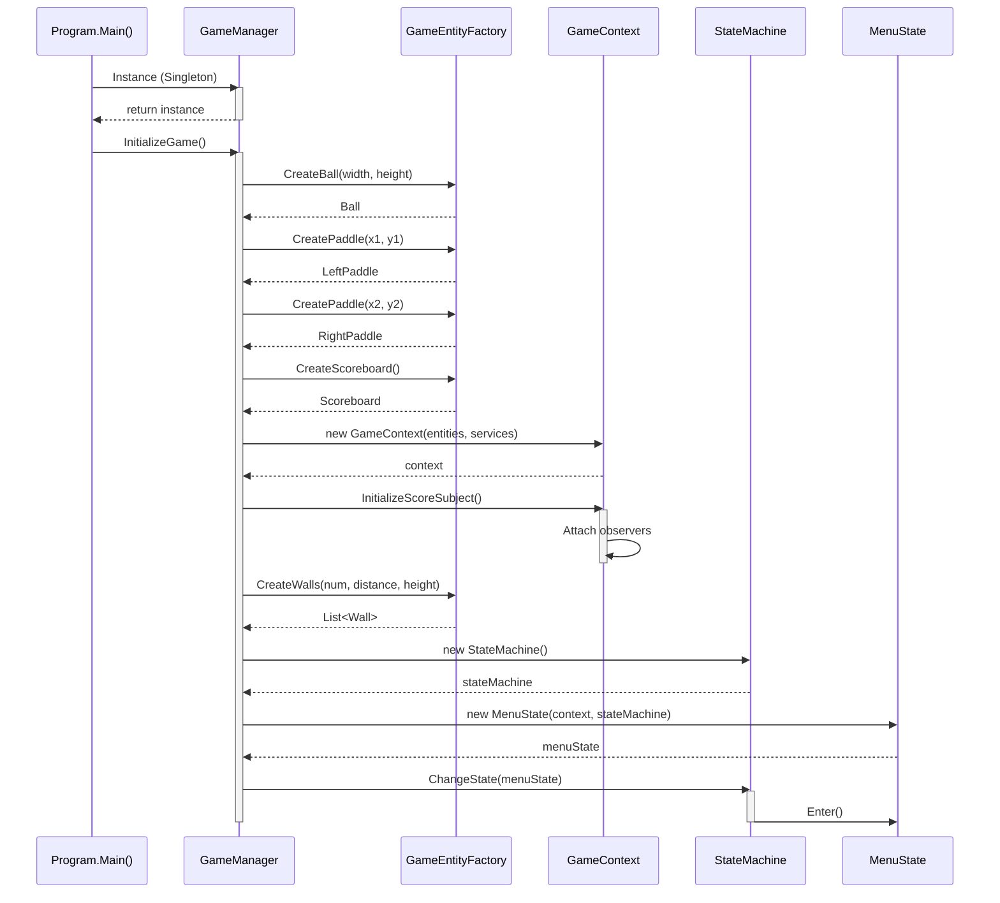

## 3. Sequence Diagram - Game Loop (Play State)

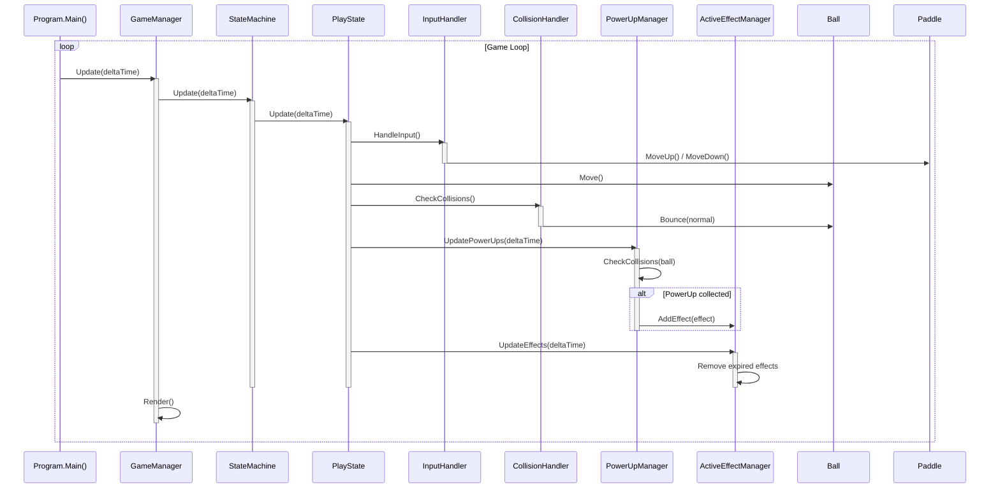

## 4. State Machine Diagram

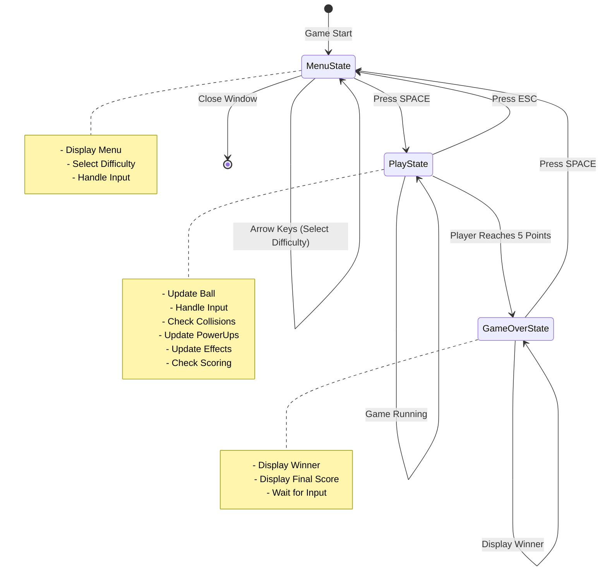

## 5. Component Pattern Structure

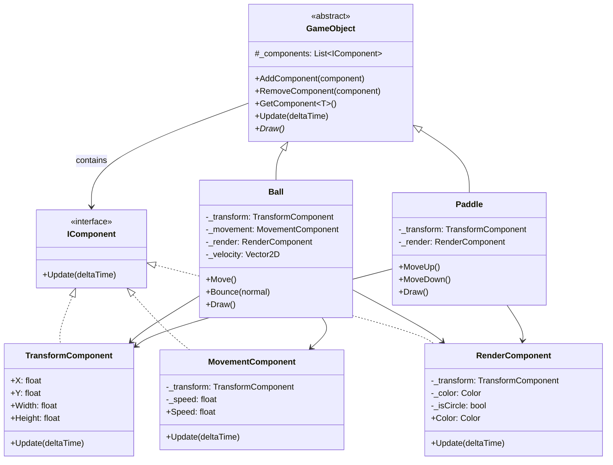

## 6. Observer Pattern - Score System

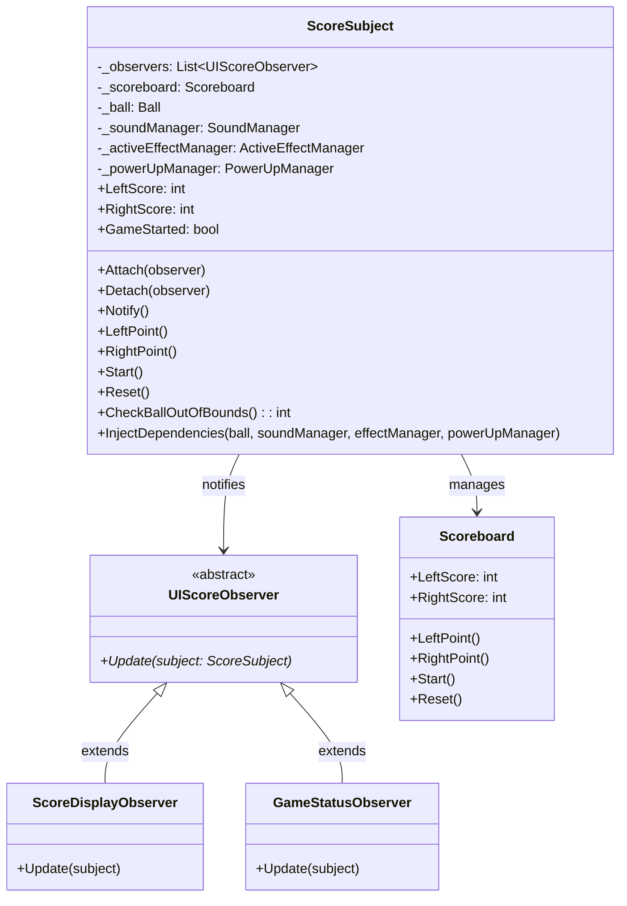

## 7. Combine Pattern - GameContext Aggregation

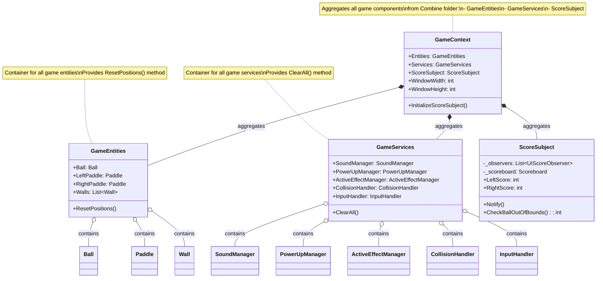

## 8. Factory Pattern Hierarchy

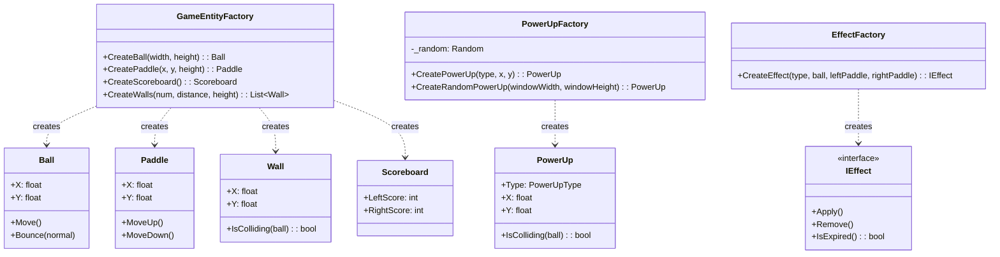

## 9. Command Pattern Structure

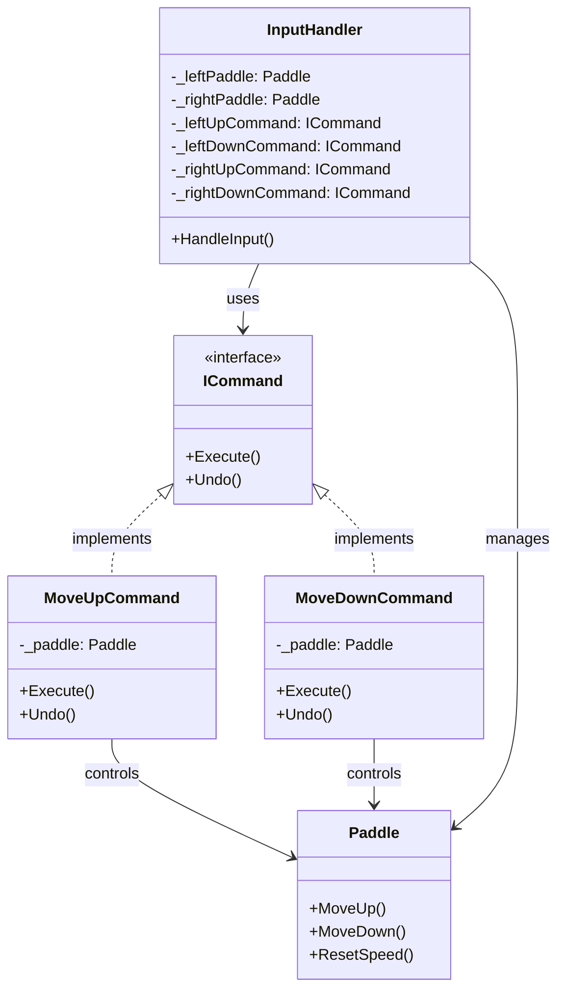

## 10. Decorator Pattern - PowerUps and Effects

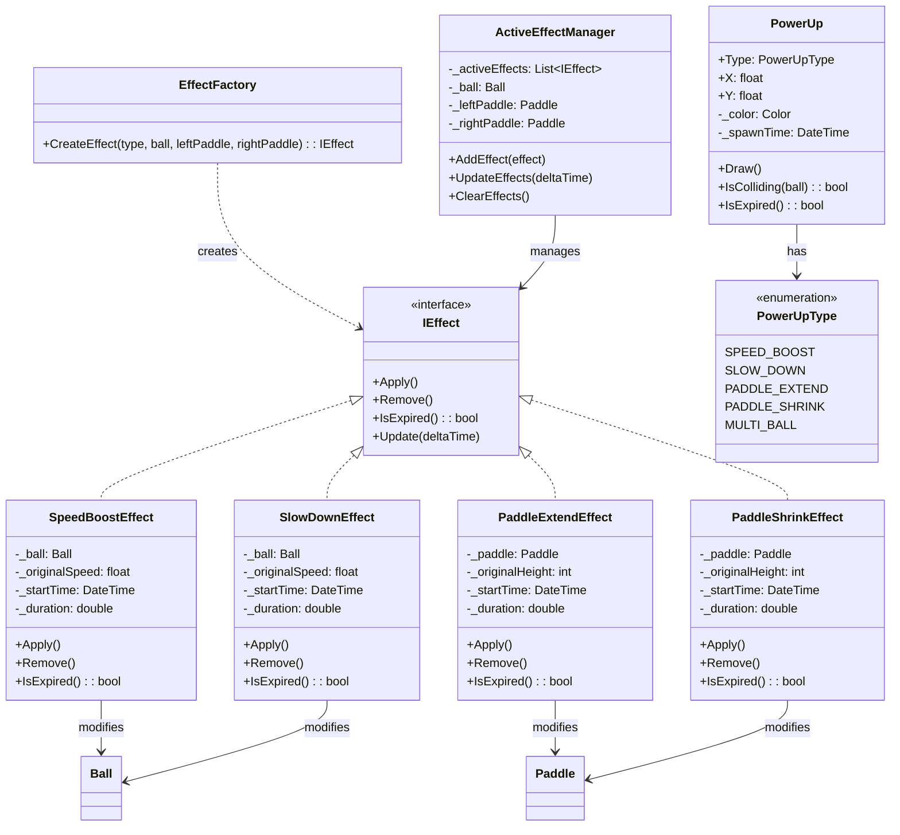

## 11. Package/Module Diagram

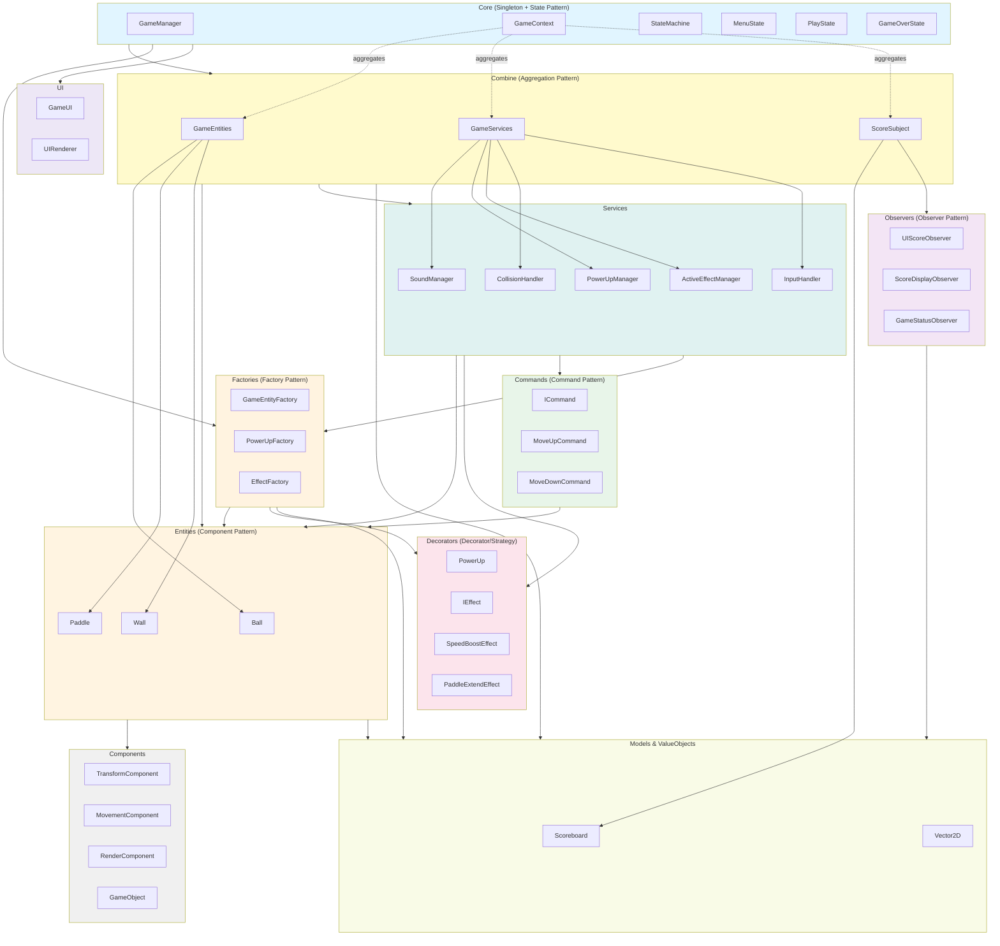
    
    Factories --> Entities
    Factories --> Decorators
    Factories --> Models
    
    Commands --> Entities
    
    style Core fill:#e1f5ff
    style Combine fill:#fffacd
    style Entities fill:#fff4e1
    style Components fill:#f0f0f0
    style Commands fill:#e8f5e9
    style Factories fill:#fff3e0
    style Observers fill:#f3e5f5
    style Decorators fill:#fce4ec
    style Services fill:#e0f2f1
    style Models fill:#f9fbe7
    style UI fill:#ede7f6
```

## Design Patterns Summary

### 1. **Singleton Pattern**
- `GameManager` - Ensures only one instance exists

### 2. **State Pattern**
- `IGameState` interface
- States: `MenuState`, `PlayState`, `GameOverState`
- Managed by `StateMachine`

### 3. **Observer Pattern**
- `ScoreSubject` notifies observers when score changes
- Observers: `UIScoreObserver` (abstract base class)
  - `ScoreDisplayObserver` - Updates UI display
  - `GameStatusObserver` - Handles game status changes

### 4. **Component Pattern**
- `GameObject` base class with `IComponent` list
- Components: `TransformComponent`, `MovementComponent`, `RenderComponent`
- Used by `Ball` and `Paddle`

### 5. **Command Pattern**
- `ICommand` interface
- Commands: `MoveUpCommand`, `MoveDownCommand`
- Executed by `InputHandler`

### 6. **Factory Pattern**
- `GameEntityFactory` - Creates game entities
- `PowerUpFactory` - Creates power-ups
- `EffectFactory` - Creates effects

### 7. **Strategy Pattern**
- `IEffect` interface with different strategies
- Effects: `SpeedBoostEffect`, `SlowDownEffect`, `PaddleExtendEffect`, `PaddleShrinkEffect`

### 8. **Decorator Pattern**
- Power-ups temporarily modify entity behavior
- Effects are applied/removed dynamically

### 9. **Dependency Injection**
- Services injected into `GameContext`
- Dependencies passed through constructors

### 10. **Value Object Pattern**
- `Vector2D` - Immutable value object for 2D vectors
- Provides mathematical operations

### 11. **Combine/Aggregation Pattern** ⭐
- `GameContext` aggregates all game components from **Combine** folder
- **`GameEntities`** - Container for all game entities (Ball, Paddles, Walls)
  - Provides `ResetPositions()` method
- **`GameServices`** - Container for all game services (Managers, Handlers)
  - Provides `ClearAll()` method
- **`ScoreSubject`** - Observer Pattern implementation for score management
  - Manages scoreboard and notifies observers
  - Integrates with game services
- **Benefits:**
  - Better organization and separation of concerns
  - Cleaner `GameContext` interface
  - Easier to maintain and extend
  - Clear responsibility boundaries

